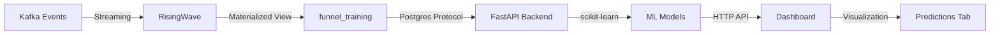

# ML Predictions with scikit-learn

This document describes the real-time ML predictions implementation using scikit-learn.

## Architecture Overview



## Components

### 1. ML Predictor Service (`modern-dashboard/backend/services/ml_predictor.py`)

The `FunnelMLPredictor` class provides:

- **Data Fetching**: Pulls training data from RisingWave's `funnel_training` view
- **Feature Engineering**: Time-based features (hour, minute, day_of_week) + lag features
- **Model Training**: Uses RandomForestRegressor (for 10+ samples) or LinearRegression (fallback)
- **Predictions**: Returns predicted values with confidence scores

#### Models

Five ML models trained for each metric:
- `viewers` - Predicts viewer count
- `carters` - Predicts cart count
- `purchasers` - Predicts purchase count
- `view_to_cart_rate` - Predicts view-to-cart conversion rate
- `cart_to_buy_rate` - Predicts cart-to-buy conversion rate

### 2. Training Data (`dbt/models/funnel_training.sql`)

Materialized view with:
- Raw funnel metrics (viewers, carters, purchasers)
- Time-based features (hour_of_day, minute_of_hour, day_of_week)
- Minute sequence for trend detection

### 3. API Integration (`modern-dashboard/backend/api.py`)

New endpoints:
- `GET /api/predictions/health` - Check ML service health
- `POST /api/predictions/train` - Train/retrain all models
- `GET /api/predictions/next` - Get next-minute predictions
- `GET /api/predictions/history` - Get historical actuals
- `GET /api/predictions/status` - Get model training status
- `GET /api/predictions/comparison` - Compare predictions vs actuals

### 4. Frontend (`modern-dashboard/frontend/src/components/PredictionsTab.jsx`)

New "Predictions" tab with:
- Real-time prediction cards (viewers, carters, purchasers)
- Predictions vs Actuals chart with trend visualization
- Conversion rate comparison (bar chart)
- Model status monitoring

## Setup Instructions

### Step 1: Start Services

```bash
# Start core services (RisingWave, Kafka, etc.)
./bin/1_up.sh
```

### Step 2: Run dbt to Create Training View

```bash
# Run dbt to create funnel_training materialized view
./bin/3_run_dbt.sh
```

### Step 3: Start Producer and Generate Data

```bash
# Start producing events (run for at least 5-10 minutes)
./bin/3_run_producer.sh
```

### Step 4: Start Dashboard

```bash
./bin/4_run_modern.sh
```

### Step 5: Train Models

Once you have at least 5 minutes of data, train the models:

```bash
# Train all ML models
curl -X POST http://localhost:8000/api/predictions/train
```

Or use the dashboard - models will auto-train on first prediction request.

### Step 6: View Predictions

Navigate to http://localhost:5173 and click the "Predictions" tab.

## How It Works

### Training Flow

1. **Data Generation**: Event producer sends page views, cart events, and purchases to Kafka
2. **Stream Processing**: RisingWave processes events into 1-minute windows via `funnel` materialized view
3. **Feature Engineering**: `funnel_training` view adds time features (hour, minute, day_of_week)
4. **Model Training**: scikit-learn trains RandomForest or LinearRegression models
5. **Lag Features**: Previous 1, 2, 3 time steps are used as features for trend context

### Prediction Flow

1. Dashboard requests predictions via `/api/predictions/next`
2. Backend queries RisingWave for latest data point
3. ML models predict next-minute values based on time features and lags
4. Dashboard displays predictions alongside actuals
5. Confidence scores indicate prediction reliability

### Model Selection

- **RandomForestRegressor**: Used when ≥10 training samples (better accuracy, captures non-linear patterns)
- **LinearRegression**: Fallback for small datasets (5-9 samples, simpler, less overfitting)

## API Examples

### Train Models

```bash
curl -X POST http://localhost:8000/api/predictions/train
```

Response:
```json
{
  "success": true,
  "message": "Trained 5 models successfully",
  "models": ["viewers", "carters", "purchasers", "view_to_cart_rate", "cart_to_buy_rate"],
  "trained_at": "2026-03-04T12:34:56.789"
}
```

### Get Predictions

```bash
curl http://localhost:8000/api/predictions/next
```

Response:
```json
{
  "predicted_at": "2026-03-04T12:34:56.789",
  "timestamp": "2026-03-04T12:35:56.789",
  "viewers": 145.3,
  "viewers_confidence": 0.85,
  "carters": 42.1,
  "carters_confidence": 0.82,
  "purchasers": 8.7,
  "purchasers_confidence": 0.79,
  "view_to_cart_rate": 0.29,
  "view_to_cart_rate_confidence": 0.88,
  "cart_to_buy_rate": 0.21,
  "cart_to_buy_rate_confidence": 0.81,
  "last_actual": {
    "timestamp": "2026-03-04T12:34:00",
    "viewers": 142,
    "carters": 41,
    "purchasers": 9,
    "view_to_cart_rate": 0.289,
    "cart_to_buy_rate": 0.220
  }
}
```

### Check Model Status

```bash
curl http://localhost:8000/api/predictions/status
```

Response:
```json
{
  "engine": "scikit-learn",
  "models": {
    "viewers": { "trained": true, "scaler_trained": true },
    "carters": { "trained": true, "scaler_trained": true },
    "purchasers": { "trained": true, "scaler_trained": true },
    "view_to_cart_rate": { "trained": true, "scaler_trained": true },
    "cart_to_buy_rate": { "trained": true, "scaler_trained": true }
  },
  "total_models": 5,
  "metrics": ["viewers", "carters", "purchasers", "view_to_cart_rate", "cart_to_buy_rate"],
  "checked_at": "2026-03-04T12:34:56.789"
}
```

## Troubleshooting

### Insufficient Data Error

If you see "Insufficient data for training", wait longer for data to accumulate:

```bash
# Check how much data is available
psql -h localhost -p 4566 -d dev -c "SELECT COUNT(*) FROM funnel_training;"
```

Minimum required: 2 samples (for live demo)

### Models Not Predicting

1. Train models manually: `curl -X POST http://localhost:8000/api/predictions/train`
2. Check backend logs for errors
3. Verify RisingWave connection: `curl http://localhost:8000/api/predictions/health`

### Poor Predictions

- **Not enough data**: Train with >10 samples for RandomForest (better accuracy)
- **High variance**: Normal for early data - models improve as more history accumulates
- **Confidence low**: Check `*_confidence` fields in prediction response

## Auto-Training

The ML models automatically retrain every 60 seconds in the background. This ensures predictions stay current as new data flows in.

### How It Works

1. Dashboard starts → Auto-training loop begins
2. Every 60 seconds → Models retrain on latest data
3. Predictions always use most recent model version

### Manual Training

If you want to force immediate training:

```bash
curl -X POST http://localhost:8000/api/predictions/train
```

## Performance Considerations

- **Training Time**: <1 second for 100 samples
- **Prediction Latency**: <50ms per request
- **Memory**: Minimal - models are lightweight (KBs, not GBs)
- **Data Volume**: Models work with as little as 5 samples, improve with 30+ minutes of data

## Model Characteristics

| Aspect | scikit-learn Implementation |
|--------|----------------------------|
| Setup Complexity | Simple (pip install) |
| Training Time | Instant (< 1 second) |
| Model Size | Lightweight (KBs) |
| Feature Engineering | Manual (time-based + lag features) |
| Accuracy | Good with proper features |
| Demo Friendly | Yes (fast iterations) |

## Future Enhancements

- Add ensemble models for better accuracy
- Implement anomaly detection on predictions
- Add confidence intervals to predictions
- Support multiple time granularities (5-min, 15-min predictions)
- Integrate external factors (marketing campaigns, time of day)
- Auto-retrain models every N minutes
