# Casino Demo Runbook

Step-by-step guide for running the production casino streaming demo end-to-end. Covers both the
quick-script path (`bin/3_run_casino_prd_demo.sh`) and the Dagster path. Includes all verification
queries and Grafana panels to check at each step.

> **Current state (2026-06-15):** RisingWave **v3.0.0**, Lakekeeper **v0.12.3**, Trino **481**,
> Redpanda single-node. Working against Brazil production topics. No mock data — the pipeline
> consumes live Kaizen events from `prd2` (casino) and `prd4` (sportsbook bets).

---

## Contents

1. [Architecture Overview](#1-architecture-overview)
2. [Service Map — Ports & URLs](#2-service-map--ports--urls)
3. [Prerequisites](#3-prerequisites)
4. [Step 1 — Start the Stack](#4-step-1--start-the-stack)
5. [Step 2 — Proto Compilation & Upload](#5-step-2--proto-compilation--upload)
6. [Step 3 — Create Kafka Sources](#6-step-3--create-kafka-sources)
7. [Step 4 — UC1: Real Bet Amount Pipeline](#7-step-4--uc1-real-bet-amount-pipeline)
8. [Step 5 — UC2: Turnover Percentage Pipeline](#8-step-5--uc2-turnover-percentage-pipeline)
9. [Step 6 — Raw Iceberg Archive](#9-step-6--raw-iceberg-archive)
10. [Step 7 — Trino Metadata Views](#10-step-7--trino-metadata-views)
11. [Step 8 — Grafana Dashboard Walkthrough](#11-step-8--grafana-dashboard-walkthrough)
12. [Step 9 — Databricks Sinks (via Dagster)](#12-step-9--databricks-sinks-via-dagster)
13. [Running via Dagster (Alternative Path)](#13-running-via-dagster-alternative-path)
14. [Complete Verification Reference](#14-complete-verification-reference)
15. [Gotchas & Known Issues](#15-gotchas--known-issues)

---

## 1. Architecture Overview

```mermaid
%%{init: {'theme': 'dark'}}%%
flowchart LR
    classDef rw fill:#1565c0,stroke:#42a5f5,color:#fff
    classDef kafka fill:#b71c1c,stroke:#ef5350,color:#fff
    classDef prodkafka fill:#e65100,stroke:#ffb74d,color:#fff
    classDef lk fill:#1b5e20,stroke:#66bb6a,color:#fff
    classDef proto fill:#880e4f,stroke:#f48fb1,color:#fff
    classDef rpsr fill:#e91e8c,stroke:#fce4ec,color:#fff
    classDef storage fill:#006064,stroke:#4dd0e1,color:#fff

    prd2["<span style='color:#f0b429'><b>prd2 Kafka — SSL</b></span><br/>cronus.casino.out.br<br/>20 partitions, ~1500 msg/s peak"]:::prodkafka
    prd4["<span style='color:#f0b429'><b>prd4 Kafka — SSL</b></span><br/>bets-out-br<br/>10 partitions"]:::prodkafka

    subgraph SCHEMA["Schema & Registry Layer"]
        direction TB
        apicurio["<span style='color:#f0b429'><b>Apicurio Schema Registry</b></span><br/>staging-schema-registry<br/>bigdata/casinoroundinfo<br/>bigdata/betinfo"]:::proto
        minio["<span style='color:#f0b429'><b>MinIO — hummock001</b></span><br/>proto/casinoroundinfodto.pb<br/>proto/betinfo.desc"]:::storage
        redpanda_sr["<span style='color:#f0b429'><b>Redpanda Schema Registry</b></span><br/>http://redpanda:8081<br/>casino_out_avro-value subject"]:::rpsr
    end

    src_casino["<span style='color:#f0b429'><b>src_casino_prd</b></span><br/>TABLE · APPEND ONLY"]:::rw
    src_bets["<span style='color:#f0b429'><b>src_bets_br</b></span><br/>TABLE · APPEND ONLY"]:::rw

    mv_txn["<span style='color:#f0b429'><b>mv_casino_transactions</b></span><br/>UNNEST Messages + Transactions<br/>one row per transaction"]:::rw

    subgraph AVRO["Avro Round-trip"]
        kafka_avro["<span style='color:#f0b429'><b>casino_out_avro</b></span><br/>Redpanda · Avro encoded<br/>full nested struct"]:::kafka
        src_avro["<span style='color:#f0b429'><b>src_casino_avro</b></span><br/>TABLE · APPEND ONLY<br/>schema.registry fetch"]:::rw
        mv_txn_full["<span style='color:#f0b429'><b>mv_casino_transactions_full</b></span><br/>enriched: game/provider metadata<br/>UNNEST Messages + Transactions"]:::rw
    end

    subgraph UC1["UC1 — Real Bet Amount"]
        mv_flat["<span style='color:#f0b429'><b>mv_casino_bets_flat</b></span><br/>filter: type=1, account=1"]:::rw
        kafka_buf["<span style='color:#f0b429'><b>Redpanda</b></span><br/>casino_bets_flat topic<br/>decoupling buffer"]:::kafka
        src_flat["<span style='color:#f0b429'><b>src_casino_bets_flat</b></span><br/>TABLE · watermarked"]:::rw
        mv_realbet["<span style='color:#f0b429'><b>mv_casino_real_bet</b></span><br/>5-min rolling SUM per customer/currency"]:::rw
    end

    subgraph UC2["UC2 — Turnover Percentage"]
        mv_cturn["<span style='color:#f0b429'><b>mv_casino_turnover_90d</b></span><br/>5-min rolling casino turnover<br/>filter: type=2, account IN 1,4"]:::rw
        mv_sturn["<span style='color:#f0b429'><b>mv_sportsbook_turnover_90d</b></span><br/>5-min rolling sportsbook turnover"]:::rw
        mv_clatest["<span style='color:#f0b429'><b>mv_casino_turnover_latest</b></span><br/>Top-1 per customer"]:::rw
        mv_slatest["<span style='color:#f0b429'><b>mv_sportsbook_turnover_latest</b></span><br/>Top-1 per customer"]:::rw
        mv_pct["<span style='color:#f0b429'><b>mv_turnover_percentage</b></span><br/>UNION ALL + GROUP BY pivot<br/>casino_ratio · sportsbook_ratio"]:::rw
    end

    %% DB declared before RP/LK so Dagre places it at the UC1/UC2 tier, not below the output layer
    subgraph DB["Databricks UC"]
        db_txn["<span style='color:#f0b429'><b>rw_casino_transactions</b></span><br/>Iceberg · append-only"]
        db_turn["<span style='color:#f0b429'><b>rw_casino_turnover_90d</b></span><br/>Iceberg · append-only"]
        db_cl["<span style='color:#f0b429'><b>rw_casino_landing</b></span><br/>Iceberg · raw protobuf bytes"]
        db_view["<span style='color:#f0b429'><b>v_casino_turnover_latest</b></span><br/>VIEW · QUALIFY ROW_NUMBER() per customer<br/>upsert semantics without delete files"]
        db_sb["<span style='color:#f0b429'><b>rw_sportsbook_bets</b></span><br/>Iceberg · append-only"]
        db_sl["<span style='color:#f0b429'><b>rw_sportsbook_landing</b></span><br/>Iceberg · raw protobuf bytes"]
    end

    mv_raw["<span style='color:#f0b429'><b>mv_casino_raw</b></span><br/>pass-through rename<br/>nested structs intact"]:::rw

    subgraph RP["Redpanda Output Topics"]
        rp_realbet["<span style='color:#f0b429'><b>casino_real_bet_output</b></span><br/>Redpanda · JSON · PoC R4"]:::kafka
        rp_turnover["<span style='color:#f0b429'><b>casino_turnover_percentage_output</b></span><br/>Redpanda · JSON · PoC R4"]:::kafka
    end
    subgraph LK["Lakekeeper REST Catalog + MinIO"]
        lk_realbet["<span style='color:#f0b429'><b>rw_managed_casino_real_bet</b></span><br/>upsert · PK: customer_id, currency_id, event_ts"]:::lk
        lk_turnover["<span style='color:#f0b429'><b>rw_managed_turnover_percentage</b></span><br/>upsert · PK: customer_id"]:::lk
        lk_raw["<span style='color:#f0b429'><b>rw_managed_casino_raw</b></span><br/>upsert · PK: unique_id<br/>full nested protobuf archive"]:::lk
    end

    trino["<span style='color:#f0b429'><b>Trino — datalake catalog</b></span><br/>Grafana panels"]

    %% Schema path
    apicurio -->|"fetch .proto · compile"| minio
    minio -->|"s3:// fetch at CREATE TABLE"| src_casino
    minio -->|"s3:// fetch at CREATE TABLE"| src_bets
    apicurio -->|"Dagster: proto→Avro · register"| redpanda_sr
    apicurio ~~~ prd2
    apicurio ~~~ prd4

    %% Kafka ingestion
    prd2 -->|SSL| src_casino
    prd4 -->|SSL| src_bets

    %% Avro round-trip
    src_casino -->|"Avro re-encode sink"| kafka_avro
    kafka_avro -->|re-ingest| src_avro
    redpanda_sr -->|"schema.registry fetch"| src_avro
    src_avro --> mv_txn_full

    %% Main processing
    src_casino --> mv_txn
    src_bets --> mv_sturn
    mv_txn --> mv_flat
    mv_txn --> mv_cturn
    mv_flat -->|Kafka sink| kafka_buf
    kafka_buf -->|re-ingest| src_flat
    src_flat --> mv_realbet
    mv_cturn --> mv_clatest
    mv_sturn --> mv_slatest
    mv_clatest --> mv_pct
    mv_slatest --> mv_pct

    %% Databricks sinks — casino path declared early, bets path last to route below UC2
    src_casino -->|append-only sink| db_cl
    mv_txn -->|append-only sink| db_txn
    mv_cturn -->|append-only sink| db_turn
    db_turn --> db_view

    %% Archive → Lakekeeper
    src_casino --> mv_raw
    mv_raw -->|"connector='iceberg' upsert"| lk_raw
    mv_realbet -->|"connector='iceberg' upsert"| lk_realbet
    mv_pct -->|"connector='iceberg' upsert"| lk_turnover
    lk_realbet --> trino
    lk_turnover --> trino
    lk_raw --> trino

    %% Kafka output sinks
    mv_realbet -->|Kafka sink · JSON| rp_realbet
    mv_pct -->|Kafka sink · JSON| rp_turnover

    %% Bets → Databricks declared last so Dagre routes below UC2
    src_bets -->|append-only sink| db_sb
    src_bets -->|append-only sink| db_sl
```



**Two execution paths** (choose one per session — they create the same RisingWave objects):

| Path | Command | When to use |
|------|---------|-------------|
| **Shell script** | `./bin/3_run_casino_prd_demo.sh` | Quick demo, no Dagster needed |
| **Dagster** | `./bin/1_up.sh` + Dagster UI job | Full observability, Databricks sinks |

---

## 2. Service Map — Ports & URLs

| Service | URL / Port | Notes |
|---------|-----------|-------|
| **RisingWave SQL** | `psql postgresql://root@localhost:4566/dev` | Main query entry point |
| **Dagster UI** | http://localhost:3000 | Pipeline orchestration |
| **Grafana** | http://localhost:3001 | Monitoring dashboards |
| **Lakekeeper REST catalog** | http://localhost:8181 | Iceberg catalog API |
| **MinIO console** | http://localhost:9400 | S3 browser (admin/hummockadmin) |
| **MinIO S3 API** | http://localhost:9301 | Used by RisingWave, Trino |
| **Prometheus** | http://localhost:9090 | Raw metrics |
| **Redpanda (Kafka external)** | `localhost:19092` | Use from host/Devbox |
| **Redpanda (Kafka internal)** | `redpanda:9092` | Container-to-container |
| **Trino** | `docker exec trino trino` | Query Iceberg + RisingWave |
| **RisingWave meta** | localhost:5690/5691 | Internal only |

---

## 3. Prerequisites

Before running the demo, verify the following:

### Network access

```bash
# Casino production Kafka (prd2) — must be accessible from your machine
nc -zv prd2-kafka-bootstrap.kaizengaming.net 443

# Sportsbook bets Kafka (prd4) — required for UC2
nc -zv prd4-kafka-bootstrap.kaizengaming.net 443

# Apicurio schema registry — required for proto fetch (fallback: pre-built .pb files exist)
curl -fs http://staging-schema-registry.kaizengaming.net/health
```

> **Gotcha:** VPN is typically required for `prd2`, `prd4`, and `staging-schema-registry`.
> If the schema registry is unreachable but `proto/casinoroundinfodto.pb` and
> `proto/betinfo.desc` already exist on disk, the script uses them as fallback and
> continues without errors.

### Tools

```bash
protoc --version     # required for proto recompilation (optional — uses pre-built .desc if absent)
docker compose version
aws --version        # for MinIO uploads; falls back to mc inside minio-0 container if absent
psql --version       # postgresql client
```

### Environment variables (Databricks sinks only)

The Databricks sinks in the dbt models require these env vars. If you are running the
shell-script path (not Dagster), these are not needed — only the Lakekeeper sinks will
be created.

```bash
export DBT_DATABRICKS_HOST="https://adb-...azuredatabricks.net"
export DATABRICKS_AZURE_TENANT_ID="..."
export DATABRICKS_AZURE_CLIENT_ID="..."
export DATABRICKS_AZURE_CLIENT_SECRET="..."
export DATABRICKS_CATALOG="de_dev"
export ADLS_ACCOUNT_NAME="..."
export ADLS_ACCOUNT_KEY="..."
```

---

## 4. Step 1 — Start the Stack

### Option A: Shell script path (demo only, no Dagster)

Start only the services needed for the casino pipeline:

```bash
docker compose up -d \
  minio-0 meta-node-0 compute-node-0 compactor-0 compactor-1 frontend-node-0 \
  lakekeeper-db lakekeeper-migrate lakekeeper lakekeeper-bootstrap \
  trino prometheus-0 grafana-0 redpanda
```

Wait for RisingWave to accept connections:

```bash
psql postgresql://root@localhost:4566/dev -tAc 'SELECT 1'
# Expected: 1
```

Wait for MinIO:

```bash
curl -fs http://localhost:9301/minio/health/live && echo "MinIO ready"
```

Wait for Lakekeeper:

```bash
curl -fs http://localhost:8181/health && echo "Lakekeeper ready"
```

### Option B: Full stack including Dagster (recommended)

```bash
./bin/1_up.sh
```

This script:
1. Runs `uv sync --upgrade` to refresh Python packages
2. Removes stale Dagster storage volume (prevents Alembic migration conflicts)
3. Runs `docker compose up -d --build` (rebuilds Dagster image if `uv.lock` changed)
4. Installs frontend npm dependencies if missing
5. Starts the sink failure watchdog

> **Offline / VPN mode:** if Docker Hub is unreachable, pass `--offline` to reuse the
> cached Dagster image: `./bin/1_up.sh --offline`. The image must have been built at
> least once while off-VPN: `docker compose build dagster-webserver`.

### Verify all services are healthy

```bash
docker compose ps
```

Expected: all services should show `running (healthy)` or `running`. The `lakekeeper-migrate`
and `lakekeeper-bootstrap` containers are one-shot init jobs — they exit `0` after completing.

### What is created at startup

| Service | What it does |
|---------|-------------|
| `minio-0` | S3-compatible object store; hosts both RisingWave Hummock state and Iceberg data files |
| `meta-node-0` | RisingWave metadata node — manages streaming job catalog |
| `compute-node-0` | RisingWave streaming executor — runs MVs and sinks |
| `compactor-0` / `compactor-1` | Hummock SST compaction + Iceberg Parquet compaction |
| `frontend-node-0` | RisingWave SQL frontend — accepts psql/JDBC on :4566 |
| `lakekeeper` | Iceberg REST catalog — tracks tables, namespaces, snapshots |
| `lakekeeper-db` | PostgreSQL backing store for Lakekeeper catalog metadata |
| `trino` | Federated query engine — queries Iceberg tables via `datalake` catalog |
| `redpanda` | Kafka-compatible broker — receives Kafka output sinks |
| `prometheus-0` | Scrapes RisingWave metrics |
| `grafana-0` | Visualizes metrics + Trino queries |

---

## 5. Step 2 — Proto Compilation & Upload

RisingWave's protobuf decoder requires a compiled binary `FileDescriptorSet` (`.pb`/`.desc`),
not raw `.proto` text. These files are compiled locally and uploaded to MinIO, where
RisingWave fetches them at `CREATE TABLE` time.

### Auto-run (via demo script)

This step is automated in `bin/3_run_casino_prd_demo.sh` — if you are using the shell script
path, skip ahead to [Step 3](#6-step-3--create-kafka-sources). This section documents the
manual steps for reference.

### Casino proto (UC1 + UC2)

```bash
# Fetch from Apicurio native v2 (returns raw .proto text)
curl -fsSL -H 'Accept: text/plain' \
  http://staging-schema-registry.kaizengaming.net/apis/registry/v2/groups/bigdata/artifacts/casinoroundinfo \
  > proto/casinoroundinfodto.proto

# Compile to binary FileDescriptorSet (--include_imports bakes in google.protobuf.Timestamp)
protoc --include_imports \
  --descriptor_set_out=proto/casinoroundinfodto.pb \
  proto/casinoroundinfodto.proto

# Upload to MinIO
AWS_ACCESS_KEY_ID=hummockadmin AWS_SECRET_ACCESS_KEY=hummockadmin \
  aws --endpoint-url http://localhost:9301 s3 cp \
    proto/casinoroundinfodto.pb s3://hummock001/proto/casinoroundinfodto.pb
```

### Bets proto (UC2 only)

```bash
# Fetch
curl -fsSL -H 'Accept: text/plain' \
  http://staging-schema-registry.kaizengaming.net/apis/registry/v2/groups/bigdata/artifacts/betinfo \
  > proto/betinfo.proto

# Note: --proto_path must include Homebrew well-known types (google/protobuf/*.proto)
protoc --include_imports \
  --descriptor_set_out=proto/betinfo.desc \
  --proto_path=/opt/homebrew/include \
  --proto_path=proto \
  proto/betinfo.proto

# Upload
AWS_ACCESS_KEY_ID=hummockadmin AWS_SECRET_ACCESS_KEY=hummockadmin \
  aws --endpoint-url http://localhost:9301 s3 cp \
    proto/betinfo.desc s3://hummock001/proto/betinfo.desc
```

### Verify the uploads

```bash
AWS_ACCESS_KEY_ID=hummockadmin AWS_SECRET_ACCESS_KEY=hummockadmin \
  aws --endpoint-url http://localhost:9301 s3 ls s3://hummock001/proto/
# Expected:
#   casinoroundinfodto.pb   (several KB)
#   betinfo.desc            (several KB)
```

Or via MinIO console at http://localhost:9400 → Browse → hummock001 → proto/

> **Notes & Gotchas:**
> - The Apicurio **ccompat** endpoint returns a Confluent-framed binary that RisingWave
>   cannot parse. Always use the **native v2** endpoint (`/apis/registry/v2/groups/.../artifacts/...`).
> - If `protoc` is not on `PATH`, the script falls back to using whatever `.pb`/`.desc`
>   files already exist on disk. If those files are missing entirely the script aborts.
> - `--proto_path=/opt/homebrew/include` is required for the bets proto because
>   `betinfo.proto` imports `google/protobuf/timestamp.proto`. Without it `protoc` fails
>   with "file not found: google/protobuf/timestamp.proto".

---

## 6. Step 3 — Create Kafka Sources

Two source tables are created: one per Kafka cluster. They are `APPEND ONLY` tables (not
views) so RisingWave persists ingested rows in its internal state store, and downstream
MVs see all historical rows, not just messages arriving after the MV was created.

### Run the demo script

```bash
./bin/3_run_casino_prd_demo.sh
```

This handles everything from proto upload through verification. If you prefer to run steps
manually, continue below.

### `src_casino_prd` — casino rounds from prd2

```bash
psql postgresql://root@localhost:4566/dev -f sql/casino_prd_source.sql
```

SQL executed:

```sql
DROP TABLE IF EXISTS src_casino_prd CASCADE;

CREATE TABLE src_casino_prd (*)       -- (*) auto-discovers columns from proto descriptor
APPEND ONLY
WITH (
    connector                     = 'kafka',
    topic                         = 'cronus.casino.out.br',
    properties.bootstrap.server   = 'prd2-kafka-bootstrap.kaizengaming.net:443',
    properties.security.protocol  = 'SSL',
    group.id.prefix               = 'rw-readonly-casino-demo',
    scan.startup.mode             = 'latest',      -- fast startup; windows fill over time
    source_rate_limit             = 1              -- near-zero during MV build (see §below)
)
FORMAT PLAIN ENCODE PROTOBUF (
    schema.location  = 's3://hummock001/proto/casinoroundinfodto.pb',
    message          = 'Cronus.CasinoService.RoundInfo.Abstractions.CasinoRoundInfoDto',
    s3.region        = 'us-east-1',
    s3.endpoint      = 'http://minio-0:9301',
    s3.access.key    = 'hummockadmin',
    s3.secret.key    = 'hummockadmin'
);
```

**Key design decisions:**

| Clause | Why |
|--------|-----|
| `CREATE TABLE` (not `SOURCE`) | Persists Kafka rows into RW state so batch `SELECT COUNT(*)` agrees with streaming MV counts |
| `(*)` | Auto-discovers all columns — no manual schema declaration needed |
| `APPEND ONLY` | Casino rounds are immutable — eliminates delete-tracking overhead |
| `scan.startup.mode = 'latest'` | Fast, history-free startup. MVs materialize in seconds. Use `'earliest'` only off-demo — full backfill grinds under backpressure and can take hours |
| `source_rate_limit = 1` | Throttles ingestion to ~0 rows/s during MV build phase. Without this the Brazil firehose (~1,500 msg/s peak) floods MinIO and causes cluster resets. Ramped to `200` after build |

Decoded top-level columns (all PascalCase — must be double-quoted in SQL):

```
"UniqueId"            VARCHAR
"CustomerId"          INT
"CompanyId"           INT
"CasinoProviderId"    INT
"ExternalProviderId"  INT
"GameInfo"            STRUCT<"GameId" INT, "ProviderGameCode" VARCHAR, "IsLive" BOOLEAN, ...>
"RoundInfo"           STRUCT<"GameRoundRef" VARCHAR,
                             "Messages" STRUCT<"MessageTypeId" INT,
                                               "Transactions" STRUCT<...>[], ...>[]>
"IsBonusLockedOnFatMessageCreation"  BOOLEAN
"IsBonusCampaignWagering"            BOOLEAN
```

### `src_bets_br` — sportsbook bets from prd4

```bash
psql postgresql://root@localhost:4566/dev -f sql/casino_prd_bets_source.sql
```

SQL executed:

```sql
DROP TABLE IF EXISTS src_bets_br CASCADE;

CREATE TABLE src_bets_br (*)
APPEND ONLY
WITH (
    connector                         = 'kafka',
    topic                             = 'bets-out-br',
    properties.bootstrap.server       = 'prd4-kafka-bootstrap.kaizengaming.net:443',
    properties.security.protocol      = 'SSL',
    group.id.prefix                   = 'rw-readonly-bets-demo',
    scan.startup.mode                 = 'latest',
    source_rate_limit                 = 1
)
FORMAT PLAIN ENCODE PROTOBUF (
    schema.location   = 's3://hummock001/proto/betinfo.desc',
    message           = 'PandoraBetInfoVm',
    messages_as_jsonb = 'PlayerSubstitutionInfoVm',   -- self-referential type → JSONB
    s3.region         = 'us-east-1',
    s3.endpoint       = 'http://minio-0:9301',
    s3.access.key     = 'hummockadmin',
    s3.secret.key     = 'hummockadmin'
);
```

> **Note on `messages_as_jsonb`:** `PlayerSubstitutionInfoVm` contains a field of its own type
> (recursive schema). RisingWave cannot represent that as a native `STRUCT`. The option decodes
> it as `JSONB` instead. UC2 only reads `TotalStake.Euro` and `PlacedAt` — these JSONB columns
> are never accessed, so there is zero runtime cost.

### Verify sources are ingesting

```sql
-- Connect to RisingWave
psql postgresql://root@localhost:4566/dev

-- Row counts grow as new Kafka messages arrive (starts near 0 with 'latest')
SELECT COUNT(*) FROM src_casino_prd;
SELECT COUNT(*) FROM src_bets_br;

-- Confirm sources are in the catalog
SELECT name, connector FROM rw_catalog.rw_sources ORDER BY name;
-- OR for tables:
SELECT name FROM rw_catalog.rw_tables WHERE name IN ('src_casino_prd', 'src_bets_br');
```

> **Gotcha:** With `scan.startup.mode = 'latest'`, counts start at 0 and grow only as
> new messages arrive. This is intentional — it prevents the multi-hour backfill that
> `'earliest'` would trigger. The rolling windows fill up within 5 minutes of live traffic.

---

## 7. Step 4 — UC1: Real Bet Amount Pipeline

**Business definition:** Total amount of real money bets placed by the customer in the casino over
the past 5 minutes (window reduced from 14 days for the single-node demo — column name retains
`rolling_1d_real_bet_amount` as a historical artifact).

### Run the pipeline

```bash
psql postgresql://root@localhost:4566/dev -v ON_ERROR_STOP=1 -f sql/casino_prd_funnel_iceberg.sql
```

> **Gotcha: database reset on first run.** The first time the Iceberg JVM cold-starts inside the
> compactor container it can take 10–20 s. If a streaming job happens to fail during that window,
> RisingWave resets the entire database (the license disables `DatabaseFailureIsolation`). The
> demo script automatically retries up to 3 times with a 15-second wait. If running manually and
> you see `ERROR: database 1 reset`, wait 15 s and re-run the file — all DDL is idempotent.

### Objects created by `sql/casino_prd_funnel_iceberg.sql`

#### In RisingWave

| Object | Type | Description |
|--------|------|-------------|
| `mv_casino_transactions` | Materialized View | Flat view: one row per transaction. Two chained UNNESTs unpack `Messages[]` then `Transactions[]`. 6 columns: `customer_id`, `message_type_id`, `account_id`, `currency_id`, `transaction_created_at`, `amount_abs` |
| `mv_casino_bets_flat` | Materialized View | UC1 filter on `mv_casino_transactions`: `message_type_id = 1` (bet placed), `account_id = 1` (real money) |
| `sink_casino_bets_flat_kafka` | Sink | Kafka sink → Redpanda topic `casino_bets_flat` (JSON). Decoupling leg 1 |
| `src_casino_bets_flat` | Table | Re-ingests `casino_bets_flat` with a proper watermark. Decoupling leg 2 |
| `mv_casino_real_bet` | Materialized View | 5-min rolling `SUM(amount_abs)` per `(customer_id, currency_id)` over `src_casino_bets_flat` |
| `mv_casino_turnover_90d` | Materialized View | 5-min rolling casino turnover per customer (`message_type_id = 2`, `account_id IN (1,4)`) |
| `mv_sportsbook_turnover_90d` | Materialized View | 5-min rolling sportsbook turnover per customer from `src_bets_br` |
| `mv_casino_turnover_latest` | Materialized View | Top-1 dedup of `mv_casino_turnover_90d` per `customer_id` |
| `mv_sportsbook_turnover_latest` | Materialized View | Top-1 dedup of `mv_sportsbook_turnover_90d` per `customer_id` |
| `mv_turnover_percentage` | Materialized View | Casino vs sportsbook ratio per customer (`UNION ALL + GROUP BY` pattern) |
| `sink_casino_real_bet` | Sink | Iceberg upsert → `rw_managed_casino_real_bet` in Lakekeeper |
| `sink_turnover_percentage` | Sink | Iceberg upsert → `rw_managed_turnover_percentage` in Lakekeeper |
| `sink_casino_real_bet_kafka` | Sink | Kafka append → Redpanda `casino_real_bet_output` (JSON) |
| `sink_turnover_percentage_kafka` | Sink | Kafka append → Redpanda `casino_turnover_percentage_output` (JSON) |

#### In Lakekeeper (Iceberg REST catalog)

| Table | Schema | PK |
|-------|--------|----|
| `public.rw_managed_casino_real_bet` | `customer_id INT, currency_id INT, event_ts TIMESTAMPTZ, rolling_1d_real_bet_amount NUMERIC` | `(customer_id, currency_id, event_ts)` |
| `public.rw_managed_turnover_percentage` | `customer_id INT, casino_turnover NUMERIC, sportsbook_turnover NUMERIC, total_turnover NUMERIC, casino_ratio NUMERIC, sportsbook_ratio NUMERIC` | `customer_id` |

> These tables are auto-created by the sinks (`create_table_if_not_exists = 'true'`).
> They are **not** queryable from RisingWave — use Trino.

#### In Redpanda (Kafka)

| Topic | Format | Contents |
|-------|--------|----------|
| `casino_bets_flat` | JSON | Internal decoupling buffer — flat UC1 bets |
| `casino_real_bet_output` | JSON | UC1 output for latency benchmark (PoC R4) |
| `casino_turnover_percentage_output` | JSON | UC2 output for latency benchmark |

### Why the Kafka round-trip decoupling (UC1)?

`mv_casino_real_bet` uses a sliding-window aggregate. If built directly on `src_casino_prd`,
the rolling window sits on the same backpressure path as all other consumers of that source.
Under Brazil load (~1,500 msg/s) this throttled throughput from ~120 rows/s to near-zero
during backfill spikes. The fix: `mv_casino_bets_flat` → Kafka sink → `src_casino_bets_flat`
(with a proper watermark) → `mv_casino_real_bet`. The Kafka buffer absorbs burst pressure.
Throughput improvement: ~120/s → ~300/s.

### Verify UC1 objects

```sql
-- In RisingWave:
psql postgresql://root@localhost:4566/dev

-- MV row counts (start near 0 with 'latest', grow with live events)
SELECT 'mv_casino_transactions'    AS mv, COUNT(*) FROM mv_casino_transactions
UNION ALL SELECT 'mv_casino_real_bet', COUNT(*) FROM mv_casino_real_bet;

-- Message type distribution (diagnostic)
SELECT message_type_id, COUNT(*)
FROM mv_casino_transactions
GROUP BY 1 ORDER BY 1;
-- MessageTypeId=1 → bet placed (UC1)
-- MessageTypeId=2 → payout/withdrawal (UC2)

-- Top customers by current rolling real bet
SELECT customer_id, currency_id, rolling_1d_real_bet_amount
FROM (
    SELECT customer_id, currency_id, rolling_1d_real_bet_amount,
           ROW_NUMBER() OVER (PARTITION BY customer_id, currency_id ORDER BY event_ts DESC) AS rn
    FROM mv_casino_real_bet
) t
WHERE rn = 1
ORDER BY rolling_1d_real_bet_amount DESC NULLS LAST
LIMIT 20;

-- Check all 4 sinks are RUNNING
SELECT name, connector, status
FROM rw_catalog.rw_sinks
WHERE name IN ('sink_casino_real_bet', 'sink_turnover_percentage',
               'sink_casino_real_bet_kafka', 'sink_turnover_percentage_kafka')
ORDER BY name;

-- Monitor DDL build progress (while sinks are initializing)
SELECT ddl_id, ddl_statement, progress FROM rw_catalog.rw_ddl_progress;
```

Wait ~30–40 seconds after the sinks are created for the first Iceberg checkpoint to commit,
then query via Trino:

```bash
# Iceberg table row counts (Trino)
docker exec trino trino --execute "
SELECT 'casino_real_bet' AS table, COUNT(*) AS rows
FROM datalake.public.rw_managed_casino_real_bet
UNION ALL
SELECT 'turnover_pct', COUNT(*)
FROM datalake.public.rw_managed_turnover_percentage"

# Top UC1 customers via Trino
docker exec trino trino --execute "
SELECT customer_id, currency_id, rolling_1d_real_bet_amount
FROM datalake.public.rw_managed_casino_real_bet
ORDER BY rolling_1d_real_bet_amount DESC NULLS LAST
LIMIT 10"

# Check for Iceberg table in Lakekeeper catalog
curl -s http://localhost:8181/catalog/v1/namespaces/public/tables | python3 -m json.tool
```

Consume Kafka output:

```bash
docker exec redpanda rpk topic consume casino_real_bet_output -n 5
```

Expected JSON format:
```json
{"customer_id":12345,"currency_id":16,"event_ts":"2026-06-15T10:23:45+00:00","rolling_1d_real_bet_amount":"245.50"}
```

---

## 8. Step 5 — UC2: Turnover Percentage Pipeline

**Business definition:** Ratio of casino betting turnover to total betting turnover (casino +
sportsbook). Both sides use a 5-minute rolling window, Euro-normalised for comparability.

UC2 objects are created by the same `sql/casino_prd_funnel_iceberg.sql` file as UC1.
If you followed Step 4 using the demo script, UC2 is already running.

### MV dependency chain

```
src_casino_prd ──→ mv_casino_transactions ──→ mv_casino_turnover_90d
                                               (filter: type_id=2, account_id IN (1,4))
                                                     │
src_bets_br ─────→ mv_sportsbook_turnover_90d ─────┤
                                                     │
                                    mv_casino_turnover_latest
                                    mv_sportsbook_turnover_latest
                                           (Top-1 per customer)
                                                     │
                                    mv_turnover_percentage
                                    (UNION ALL + GROUP BY pivot)
                                           │         │
                           sink_turnover_percentage  sink_turnover_percentage_kafka
                           (Iceberg → Lakekeeper)    (Kafka → Redpanda)
```

### Key implementation notes

**`mv_sportsbook_turnover_90d` Euro reconstruction:**
`TotalStake.Euro` uses the `DecimalValue` proto encoding: two fields, `units` (integer) and
`nanos` (fractional × 10⁻⁹). The full Euro value is reconstructed as:

```sql
(("TotalStake")."Euro")."units"::NUMERIC
+ (("TotalStake")."Euro")."nanos"::NUMERIC / 1000000000
```

**`ROW_NUMBER()` Top-1 (not `DISTINCT ON`):**
`DISTINCT ON (customer_id) ORDER BY customer_id, event_ts DESC` does not work in RisingWave
streaming mode — the `ORDER BY` applies only at DDL time, not to ongoing updates. Use
`ROW_NUMBER() OVER (PARTITION BY customer_id ORDER BY event_ts DESC) = 1` instead, which
compiles to RisingWave's stateful `TopN` operator.

**`UNION ALL + GROUP BY` (not `FULL OUTER JOIN`):**
A `FULL OUTER JOIN` of the two `*_latest` MVs on `customer_id` panics under live ingestion
(`double inserting a join state entry`) because the `TopN` operator emits retract+insert
pairs that can arrive out of order. The `UNION ALL + GROUP BY` pivot is semantically
equivalent and applies `+`/`-` deltas safely.

### Verify UC2 objects

```sql
psql postgresql://root@localhost:4566/dev

-- Row counts
SELECT 'mv_casino_turnover_90d'          AS mv, COUNT(*) FROM mv_casino_turnover_90d
UNION ALL SELECT 'mv_sportsbook_turnover_90d',  COUNT(*) FROM mv_sportsbook_turnover_90d
UNION ALL SELECT 'mv_casino_turnover_latest',   COUNT(*) FROM mv_casino_turnover_latest
UNION ALL SELECT 'mv_sportsbook_turnover_latest', COUNT(*) FROM mv_sportsbook_turnover_latest
UNION ALL SELECT 'mv_turnover_percentage',      COUNT(*) FROM mv_turnover_percentage;

-- Top customers by total turnover
SELECT customer_id, casino_ratio, sportsbook_ratio, total_turnover
FROM mv_turnover_percentage
ORDER BY total_turnover DESC NULLS LAST LIMIT 20;

-- Verify ratios sum to 1 (should return 0 rows)
SELECT customer_id, casino_ratio + sportsbook_ratio AS sum_check
FROM mv_turnover_percentage
WHERE casino_ratio + sportsbook_ratio NOT BETWEEN 0.9999 AND 1.0001
LIMIT 5;
```

```bash
# Iceberg UC2 output (Trino)
docker exec trino trino --execute "
SELECT customer_id, casino_ratio, sportsbook_ratio, total_turnover
FROM datalake.public.rw_managed_turnover_percentage
ORDER BY total_turnover DESC NULLS LAST LIMIT 10"

# Kafka UC2 output
docker exec redpanda rpk topic consume casino_turnover_percentage_output -n 5
```

Expected JSON format:
```json
{"customer_id":12345,"casino_turnover":"3924.70","sportsbook_turnover":"1200.00","total_turnover":"5124.70","casino_ratio":"0.7659","sportsbook_ratio":"0.2341"}
```

---

## 9. Step 6 — Raw Iceberg Archive

A faithful archival copy of the full nested protobuf structure, written to Iceberg without
flattening. Useful for replaying or reprocessing with different business logic.

```bash
psql postgresql://root@localhost:4566/dev -v ON_ERROR_STOP=1 -f sql/casino_prd_raw_iceberg.sql
```

### Objects created

| Object | Type | Location | Description |
|--------|------|----------|-------------|
| `mv_casino_raw` | Materialized View (RisingWave) | RisingWave | Pass-through rename: PascalCase → snake_case for top-level columns; struct columns flow through unchanged |
| `rw_managed_casino_raw` | ENGINE=iceberg table (RisingWave) | Lakekeeper | Schema-declared Iceberg table with full nested struct columns |
| `rw_managed_casino_raw_sink` | Sink (RisingWave) | → Lakekeeper | Upsert sink from `mv_casino_raw` into `rw_managed_casino_raw` |

The `rw_managed_casino_raw` table has the full schema including nested `game_info`,
`round_info` (with `Messages[]` → `Transactions[]` arrays), and metadata booleans.
Primary key is `unique_id` (the `UniqueId` field from the proto).

### Verify

```sql
psql postgresql://root@localhost:4566/dev

SELECT COUNT(*) FROM mv_casino_raw;

SELECT name, connector, status FROM rw_catalog.rw_sinks
WHERE name = 'rw_managed_casino_raw_sink';
```

```bash
# After first checkpoint commit (~30-40s):
docker exec trino trino --execute "SELECT COUNT(*) FROM datalake.public.rw_managed_casino_raw"

# Sample nested struct data
docker exec trino trino --execute "
SELECT unique_id, customer_id, game_info
FROM datalake.public.rw_managed_casino_raw
LIMIT 5"
```

> **Note:** `background_ddl = true` is set before the sink `CREATE`, so `psql` returns
> immediately while the initial snapshot commits asynchronously. The sink will appear in
> `rw_catalog.rw_sinks` as `CREATING` briefly, then `RUNNING`.

---

## 10. Step 7 — Trino Metadata Views

Trino's Iceberg metadata tables (`table$snapshots`, `table$partitions`) contain a `$`,
which Grafana interprets as a variable and breaks. Dollar-free views are created as
workarounds. These are also used for performance: the `$partitions` view gives instant
row counts via metadata reads (`SUM(record_count)`) instead of a full `COUNT(*)` scan.

These views are created automatically by `bin/3_run_casino_prd_demo.sh` (step 9 of 9).
The Dagster `casino_trino_views` asset does the same.

### Manual creation

```bash
docker exec trino trino --execute "
CREATE OR REPLACE VIEW datalake.public.casino_real_bet_snapshots AS
  SELECT snapshot_id, operation, CAST(committed_at AS timestamp(6)) AS committed_at
  FROM datalake.public.\"rw_managed_casino_real_bet\$snapshots\";

CREATE OR REPLACE VIEW datalake.public.turnover_pct_snapshots AS
  SELECT snapshot_id, operation, CAST(committed_at AS timestamp(6)) AS committed_at
  FROM datalake.public.\"rw_managed_turnover_percentage\$snapshots\";

CREATE OR REPLACE VIEW datalake.public.casino_real_bet_rowcount AS
  SELECT SUM(record_count) AS iceberg_rows
  FROM datalake.public.\"rw_managed_casino_real_bet\$partitions\";

CREATE OR REPLACE VIEW datalake.public.turnover_pct_rowcount AS
  SELECT SUM(record_count) AS iceberg_rows
  FROM datalake.public.\"rw_managed_turnover_percentage\$partitions\";
" 2>&1 | grep -v "WARNING\|jline\|terminal"
```

### Verify via Trino

```bash
# Snapshot history — confirm commits are happening
docker exec trino trino --execute "
SELECT snapshot_id, operation, committed_at
FROM datalake.public.casino_real_bet_snapshots
ORDER BY committed_at DESC LIMIT 10"

# Operation types: 'append' = checkpoint commit, 'replace' = compaction merge
docker exec trino trino --execute "
SELECT operation, COUNT(*) AS count
FROM datalake.public.casino_real_bet_snapshots
GROUP BY operation"

# Instant row count (metadata read, no scan)
docker exec trino trino --execute "SELECT iceberg_rows FROM datalake.public.casino_real_bet_rowcount"
docker exec trino trino --execute "SELECT iceberg_rows FROM datalake.public.turnover_pct_rowcount"

# Live data file count (health check — should decrease as compaction runs)
docker exec trino trino --execute "
SELECT COUNT(*) AS file_count
FROM datalake.public.\"rw_managed_casino_real_bet\$files\""
```

> **Gotcha:** These views must be recreated after every full stack restart — they live only in
> Trino's catalog state, which resets when the Trino container restarts. Both the demo script
> and the Dagster asset handle this automatically.

---

## 11. Step 8 — Grafana Dashboard Walkthrough

Open **http://localhost:3001** → Dashboards → RisingWave → **Casino PoC — UC1 & UC2 Metrics**

The dashboard auto-refreshes every 1 minute. Use the time picker in the top-right to zoom in.

### Row 1: UC1 — Casino Real Bet Amount

| Panel | Data source | What to look for |
|-------|-------------|-----------------|
| **Customers Tracked (UC1)** | Prometheus / RW SQL | Non-zero, growing as live events arrive |
| **MV Row Count (mv_casino_real_bet)** | Prometheus | Row count from RisingWave — one row per bet event (sliding window emits a new row per event) |
| **Iceberg Rows (rw_managed_casino_real_bet)** | Trino → `casino_real_bet_rowcount` view | Metadata read (instant). Lags MV by ~30–40 s (one commit interval). Should grow |
| **Total Real Bet Volume (1d rolling)** | RW SQL | Sum of all `rolling_1d_real_bet_amount` values. Shown without currency symbol (currency_id mapping not yet confirmed) |
| **Most Recently Active Customers — UC1 table** | RW SQL | Shows Latest Bet, 1-Day Real Bet Amount, Last Event columns; sorted by most recent event |

### Row 2: UC2 — Casino Turnover Percentage

| Panel | Data source | What to look for |
|-------|-------------|-----------------|
| **Customers Tracked (UC2)** | RW SQL | Count of distinct customers in `mv_turnover_percentage` |
| **Avg Casino Ratio** | RW SQL | Average `casino_ratio` across all customers — should be between 0 and 1 |
| **Iceberg Rows (rw_managed_turnover_percentage)** | Trino → `turnover_pct_rowcount` | One row per unique customer tracked. Lags by one commit interval |
| **Total Tracked Turnover (EUR, 7d rolling)** | RW SQL | Sum of `total_turnover`. UC2 amounts are correctly in EUR |
| **Top 20 Customers by Casino Turnover** | RW SQL | Table with `casino_ratio` + `sportsbook_ratio` columns — both should sum to ~100% per row |
| **Top 20 Customers by Sportsbook Turnover** | RW SQL | Same layout, sorted by sportsbook side |

### Row 3: Source Ingestion

| Panel | Data source | What to look for |
|-------|-------------|-----------------|
| **Casino Source Throughput (rows/s)** | Prometheus | Rising wave ingestion rate from `src_casino_prd`. Should be ~0 during MV build (`source_rate_limit=1`), then ~200/s after the Dagster ramp-up step |
| **Streaming Backpressure** | Prometheus | 0 = healthy. Values >1 mean a downstream operator (usually an Iceberg sink) is slower than upstream. Brief spikes during compaction are normal; sustained >5 warrants investigation |

### Row 4: Kafka Output Sinks (PoC R4)

| Panel | What to look for |
|-------|-----------------|
| **Kafka Sink Throughput (rows/s)** | Both `casino_real_bet_output` and `casino_turnover_pct_output` should show non-zero throughput matching the source ingestion rate |

### Row 5: Lakekeeper Iceberg Sinks

| Panel | What to look for |
|-------|-----------------|
| **Iceberg Commits / min (true cadence)** | Should show ~1.5–2 commits/min at `commit_checkpoint_interval=20` |
| **Iceberg Snapshot Count Over Time** | Should plateau or grow slowly (compaction keeps it bounded). If it grows unboundedly, compaction may not be running |
| **Iceberg Operations / min — casino_real_bet** | `append` lines = checkpoint commits, `replace` lines = compaction merges. Both `append` AND `replace` non-zero confirms compaction is running |
| **Iceberg Operations / min — turnover_pct** | Same interpretation |
| **Iceberg Live Data Files** | Should be low and stable (compaction keeps it bounded). High file counts mean compaction is behind |
| **Iceberg Write Throughput (bytes/s)** | Should correlate with ingestion rate |

### Row 6: Databricks Iceberg Sinks

These panels show data only when the Databricks sinks are active (Dagster path, requires
Databricks env vars). When not configured, all stats show 0 or null.

| Panel | What to look for |
|-------|-----------------|
| **Casino Transactions — Row Count** | Rows in `de_dev.rw_poc.rw_casino_transactions` |
| **Casino Transactions — Minutes Since Last Event** | Should be < 5 minutes if sinks are running |
| **Sportsbook Bets — Row Count** | Rows in `de_dev.rw_poc.rw_sportsbook_bets` |
| **Casino — Live Parquet Files** | Should decrease as Databricks compaction runs |
| **Casino — Snapshot Count** | Growing at ~1-2/min while sinks are active |
| **Turnover 90d — Row Count** | Rows in `de_dev.rw_poc.rw_casino_turnover_90d` |
| **Turnover 90d — Snapshots vs Current Customers** | Ratio check — snapshots / MV row count |

### Row 7: Databricks Landing Layer

| Panel | What to look for |
|-------|-----------------|
| **Casino Landing — Row Count** | Raw protobuf bytes in `de_dev.rw_poc.rw_casino_landing` |
| **Casino Landing Bronze — Row Count** | Decoded/typed rows in bronze table (populated by Databricks notebook job) |
| **Sportsbook Landing — Row Count** | Raw bytes in `de_dev.rw_poc.rw_sportsbook_landing` |

---

## 12. Step 9 — Databricks Sinks (via Dagster)

The Databricks sinks are dbt models tagged `databricks` and require Unity Catalog credentials.
They are **only deployed via the Dagster path** (not the shell script path).

### Tables created in Databricks Unity Catalog

All tables are in `de_dev.rw_poc`:

| Table | Schema | Sink | Description |
|-------|--------|------|-------------|
| `rw_casino_transactions` | `customer_id INT, message_type_id INT, account_id INT, currency_id INT, transaction_created_at TIMESTAMP, amount_abs DECIMAL(20,8), properties STRING` | `sink_casino_transactions_databricks` | Flattened transactions from `mv_casino_transactions_full` (append-only) |
| `rw_sportsbook_bets` | `bet_id BIGINT, customer_id INT, ..., placed_at TIMESTAMP, stake_euro DECIMAL(20,8), stake_local DECIMAL(20,8), properties STRING` | `sink_sportsbook_bets_databricks` | Flat sportsbook bets from `mv_sportsbook_bets` (append-only) |
| `rw_casino_turnover_90d` | `customer_id INT, event_ts TIMESTAMP, rolling_7d_turnover DECIMAL(38,8)` | `sink_casino_turnover_90d_databricks` | Rolling turnover from `mv_casino_turnover_90d` (append-only) |
| `rw_casino_landing` | `payload BINARY, kafka_key BINARY, kafka_timestamp TIMESTAMP, kafka_partition STRING, kafka_offset STRING, year_month STRING` | `sink_casino_landing_databricks` | Raw protobuf bytes from `mv_casino_landing` (append-only archive) |
| `rw_sportsbook_landing` | `payload BINARY, kafka_key BINARY, kafka_timestamp TIMESTAMP, kafka_partition STRING, kafka_offset STRING, year_month STRING` | `sink_sportsbook_landing_databricks` | Raw protobuf bytes from `mv_sportsbook_landing` (append-only archive) |

All tables use `TBLPROPERTIES ('history.expire.min-snapshots-to-keep' = '50')`.

### Verify in Databricks

```sql
-- In Databricks SQL or a notebook:

USE de_dev.rw_poc;

-- Row counts
SELECT 'rw_casino_transactions' AS t, COUNT(*) FROM rw_casino_transactions
UNION ALL SELECT 'rw_sportsbook_bets', COUNT(*) FROM rw_sportsbook_bets
UNION ALL SELECT 'rw_casino_turnover_90d', COUNT(*) FROM rw_casino_turnover_90d
UNION ALL SELECT 'rw_casino_landing', COUNT(*) FROM rw_casino_landing
UNION ALL SELECT 'rw_sportsbook_landing', COUNT(*) FROM rw_sportsbook_landing;

-- Recent transactions
SELECT * FROM rw_casino_transactions
ORDER BY transaction_created_at DESC LIMIT 20;

-- Snapshot history
DESCRIBE HISTORY rw_casino_transactions LIMIT 10;

-- Turnover rolling window per customer
SELECT customer_id, rolling_7d_turnover
FROM rw_casino_turnover_90d
ORDER BY rolling_7d_turnover DESC
LIMIT 20;
```

### Dagster asset: `databricks_uc_tables_setup`

Before dbt creates the Databricks sinks, Dagster runs `databricks_uc_tables_setup` to
pre-create the UC tables. It probes each table with `SELECT 1 LIMIT 0` first — if it
exists, the DDL is skipped (no-op on warm restarts). If absent, it runs
`CREATE TABLE IF NOT EXISTS ... USING ICEBERG`.

This step runs automatically as part of `casino_prd_full_job`. It is idempotent.

---

## 13. Running via Dagster (Alternative Path)

The Dagster path provides full observability, automatic retry on transient failures,
and handles the Databricks sinks + post-build rate ramp-up.

### Step 1: Start the full stack

```bash
./bin/1_up.sh
```

Then open **http://localhost:3000** (Dagster UI).

### Step 2: Run the casino pipeline job

1. Navigate to **Jobs** → `casino_prd_full_job`
2. Click **Materialize all**
3. Dagster resolves execution order automatically

The job runs in this dependency order:

```
casino_prd_proto_fetch
  → casino_prd_proto_compile
    → casino_prd_proto_upload
      → [databricks_uc_tables_setup] (parallel, if Databricks creds present)
        → casino_prd_dbt_assets  (all UC1 + UC2 dbt models in one step)
          → casino_trino_views
          → databricks_turnover_latest_view (optional)
```

### Step 3: Monitor in Dagster

- Go to **Runs** → click the active run
- Each asset tile turns green on success; click any tile to view logs
- If the proto fetch fails (VPN required), the pre-built `.pb`/`.desc` files on disk
  are used as fallback — the run continues

### Step 4: Asset groups in the UI

| Group | Assets | Description |
|-------|--------|-------------|
| `casino_prd_setup` | `casino_prd_proto_fetch`, `casino_prd_proto_compile`, `casino_prd_proto_upload`, `casino_trino_views` | Prerequisites and post-setup |
| `casino_uc1` | `src_casino_prd`, `mv_casino_transactions_full`, `mv_casino_real_bet`, `sink_casino_real_bet`, `sink_casino_real_bet_kafka` | Real bet pipeline |
| `casino_uc2` | `src_bets_br`, `mv_casino_turnover_90d`, `mv_sportsbook_turnover_90d`, `mv_casino_turnover_latest`, `mv_sportsbook_turnover_latest`, `mv_turnover_percentage`, `sink_turnover_percentage`, `sink_turnover_percentage_kafka` | Turnover pipeline |
| `casino_databricks` | `databricks_uc_tables_setup`, Databricks sink models | Unity Catalog tables |
| `casino_lakekeeper` | Lakekeeper sink models | Lakekeeper Iceberg tables |

### Partial re-runs

| What to re-run | How |
|---------------|-----|
| Proto schemas only | Assets → select `casino_prd_proto_fetch` / `compile` / `upload` → Materialize |
| UC1 models only | Assets → filter group `casino_uc1` → Materialize selected |
| UC2 models only | Assets → filter group `casino_uc2` → Materialize selected |
| Trino views only | Assets → select `casino_trino_views` → Materialize |
| Full pipeline | Jobs → `casino_prd_full_job` → Materialize all |

> **Note:** UC1 and UC2 are built together in a single `casino_prd_dbt_assets` step.
> There are no separate per-UC jobs. For partial runs, materialize assets directly from
> the Assets page.

---

## 14. Complete Verification Reference

### RisingWave — all objects

```sql
psql postgresql://root@localhost:4566/dev

-- All tables (sources)
SELECT name, connector FROM rw_catalog.rw_tables
WHERE name IN ('src_casino_prd', 'src_bets_br', 'src_casino_bets_flat')
ORDER BY name;

-- All materialized views
SELECT name FROM rw_catalog.rw_materialized_views
WHERE name LIKE 'mv_casino%' OR name LIKE 'mv_sportsbook%' OR name LIKE 'mv_turnover%'
ORDER BY name;

-- All sinks with status
SELECT name, connector, status FROM rw_catalog.rw_sinks
WHERE name LIKE '%casino%' OR name LIKE '%turnover%' OR name LIKE '%bets_flat%'
ORDER BY name;

-- Expected sinks (6 total):
--   rw_managed_casino_raw_sink      | iceberg | RUNNING
--   sink_casino_bets_flat_kafka     | kafka   | RUNNING
--   sink_casino_real_bet            | iceberg | RUNNING
--   sink_casino_real_bet_kafka      | kafka   | RUNNING
--   sink_turnover_percentage        | iceberg | RUNNING
--   sink_turnover_percentage_kafka  | kafka   | RUNNING

-- Full row count summary
SELECT 'src_casino_prd'                AS object, COUNT(*) FROM src_casino_prd
UNION ALL SELECT 'src_bets_br',                   COUNT(*) FROM src_bets_br
UNION ALL SELECT 'mv_casino_transactions',         COUNT(*) FROM mv_casino_transactions
UNION ALL SELECT 'mv_casino_real_bet',             COUNT(*) FROM mv_casino_real_bet
UNION ALL SELECT 'mv_casino_turnover_90d',         COUNT(*) FROM mv_casino_turnover_90d
UNION ALL SELECT 'mv_sportsbook_turnover_90d',     COUNT(*) FROM mv_sportsbook_turnover_90d
UNION ALL SELECT 'mv_casino_turnover_latest',      COUNT(*) FROM mv_casino_turnover_latest
UNION ALL SELECT 'mv_sportsbook_turnover_latest',  COUNT(*) FROM mv_sportsbook_turnover_latest
UNION ALL SELECT 'mv_turnover_percentage',         COUNT(*) FROM mv_turnover_percentage
UNION ALL SELECT 'mv_casino_raw',                  COUNT(*) FROM mv_casino_raw;
```

### Trino — Iceberg tables

```bash
# All Iceberg tables in Lakekeeper
docker exec trino trino --execute "SHOW TABLES IN datalake.public"

# Row counts (metadata-based, instant)
docker exec trino trino --execute "
SELECT iceberg_rows FROM datalake.public.casino_real_bet_rowcount;
SELECT iceberg_rows FROM datalake.public.turnover_pct_rowcount;"

# Full-scan row counts (slower, exact)
docker exec trino trino --execute "
SELECT 'casino_real_bet' AS t, COUNT(*) FROM datalake.public.rw_managed_casino_real_bet
UNION ALL SELECT 'turnover_pct',   COUNT(*) FROM datalake.public.rw_managed_turnover_percentage
UNION ALL SELECT 'casino_raw',     COUNT(*) FROM datalake.public.rw_managed_casino_raw"

# Snapshot history — confirm commits and compaction
docker exec trino trino --execute "
SELECT operation, COUNT(*) FROM datalake.public.casino_real_bet_snapshots GROUP BY operation"
# append = checkpoint commits, replace = compaction merges

# Partition metadata
docker exec trino trino --execute "
SELECT file_count, record_count, total_size
FROM datalake.public.\"rw_managed_casino_real_bet\$partitions\""
```

### Redpanda — Kafka topics

```bash
# List all topics
docker exec redpanda rpk topic list

# Expected casino-related topics:
#   casino_bets_flat
#   casino_real_bet_output
#   casino_turnover_percentage_output

# Consume from each
docker exec redpanda rpk topic consume casino_bets_flat -n 5
docker exec redpanda rpk topic consume casino_real_bet_output -n 5
docker exec redpanda rpk topic consume casino_turnover_percentage_output -n 5

# Topic offsets / lag
docker exec redpanda rpk topic describe casino_real_bet_output
```

### Lakekeeper — catalog health

```bash
# Health check
curl -s http://localhost:8181/health | python3 -m json.tool

# List namespaces
curl -s http://localhost:8181/catalog/v1/namespaces | python3 -m json.tool

# List tables in public namespace
curl -s "http://localhost:8181/catalog/v1/namespaces/public/tables" | python3 -m json.tool

# Table metadata (current snapshot)
curl -s "http://localhost:8181/catalog/v1/namespaces/public/tables/rw_managed_casino_real_bet" \
  | python3 -c "import json,sys; d=json.load(sys.stdin); print(json.dumps(d.get('metadata',{}).get('current-snapshot-id',''), indent=2))"
```

### MinIO — object storage

```bash
# Total objects in hummock001 bucket
AWS_ACCESS_KEY_ID=hummockadmin AWS_SECRET_ACCESS_KEY=hummockadmin \
  aws --endpoint-url http://localhost:9301 s3 ls s3://hummock001/ --recursive --summarize \
  | tail -3

# Proto descriptors
AWS_ACCESS_KEY_ID=hummockadmin AWS_SECRET_ACCESS_KEY=hummockadmin \
  aws --endpoint-url http://localhost:9301 s3 ls s3://hummock001/proto/

# Iceberg data files for casino_real_bet
AWS_ACCESS_KEY_ID=hummockadmin AWS_SECRET_ACCESS_KEY=hummockadmin \
  aws --endpoint-url http://localhost:9301 s3 ls \
  s3://hummock001/risingwave-warehouse/public/rw_managed_casino_real_bet/ --recursive \
  | grep ".parquet" | wc -l
```

---

## 15. Gotchas & Known Issues

### General

**`database 1 reset` on pipeline creation**
The license cap disables `DatabaseFailureIsolation`. Any single streaming job failure
(e.g. Iceberg JVM cold start, MinIO timeout) resets the entire database. All DDL files use
`DROP ... IF EXISTS CASCADE`, so rerunning is safe. The demo script retries up to 3 times
with a 15-second wait between attempts. Manual recovery: wait 15 s, then re-run the SQL file.

**`schema.location` requires binary FDS, not `.proto` text**
Apicurio's native v2 endpoint returns the raw `.proto` text. Passing that URL to
`schema.location` fails. Must compile with `protoc --include_imports` first to get the
binary `FileDescriptorSet`.

**PascalCase identifiers must be double-quoted**
RisingWave preserves protobuf field names verbatim. Unquoted `CustomerId` folds to `customerid`
and fails. Always quote: `s."CustomerId"`.

**Struct field access requires parentheses**
`s."RoundInfo"."Messages"` is parsed as `schema.table.column` and fails. Use
`(s."RoundInfo")."Messages"`.

**`Amount` is a string field in the proto**
Proto3 encodes absent strings as `''`. Always guard with `NULLIF(txn."Amount", '')::numeric`.

**Decimal-as-string vs DecimalValue encoding**
Casino `Amount` fields are `string` typed. Sportsbook `TotalStake.Euro` uses the proto
`DecimalValue` encoding (`units` + `nanos`). These require different extraction patterns
in SQL.

### RisingWave version-specific (v3.0.0)

**`CREATE VIEW` over Iceberg source fails with DataFusion enabled**
`enable_datafusion_engine` defaults to `true` in v3.0.0. `CREATE VIEW ... AS SELECT * FROM
<iceberg_source>` fails with `Expected RisingWave plan in BatchPlanChoice, but got DataFusion
plan`. Workaround: `SET enable_datafusion_engine = false` before the `CREATE VIEW`. The dbt
models apply this automatically via `pre_hook`.

**`enable_pk_index = 'true'` crashes compute node**
The executor for deletion-vector upserts was not shipped in v3.0.0 even though the DDL is
accepted. The compute node crashes seconds after `CREATE SINK ... enable_pk_index = 'true'`.
Do not use it.

**Snapshot expiration now works (was broken through v2.8.4)**
`enable_snapshot_expiration = 'true'` is effective as of v3.0.0 with the Lakekeeper REST
catalog. Was silently a no-op in all earlier versions. The sinks already carry this option.

### Streaming SQL patterns

**`scan.startup.mode = 'latest'` vs `'earliest'`**
The pipeline ships with `'latest'` (fast startup; rolling windows fill over time). `'earliest'`
triggers full-history backfill which can take hours against Brazil topics under backpressure.
Run it off-demo only. If you change this, the source must be dropped and recreated.

**`background_ddl = true` breaks chained MV creation**
When `background_ddl = true`, `CREATE MATERIALIZED VIEW` returns before the object is
catalog-visible. Must NOT be set during the MV chain — each step must see the previous MV
in the catalog before referencing it. Set it only after all MVs are created, immediately
before the first `CREATE SINK`.

**`commit_checkpoint_interval` counts checkpoints, not seconds**
`commit_checkpoint_interval = 20` means "commit every 20 checkpoints." With
`barrier_interval_ms = 2000`:
```
commit cadence ≈ 20 × 2000 ms ≈ ~30–40 seconds
```
The Grafana "commits/min" metric is per-actor, so it reads higher than the true
table-level commit rate.

**`connector='iceberg'` sinks, not `ENGINE = iceberg`**
`enable_compaction` is silently ignored on `ENGINE = iceberg` managed tables. Use
`connector='iceberg'` sinks with `create_table_if_not_exists='true'`. Query the resulting
tables via Trino.

**`DISTINCT ON` is unreliable for Top-1 in streaming**
Use `ROW_NUMBER() OVER (PARTITION BY ... ORDER BY event_ts DESC) = 1` instead. See UC2
`mv_casino_turnover_latest` for the canonical pattern.

**`FULL OUTER JOIN` with `ROW_NUMBER()` Top-1 inputs panics the database**
Use `UNION ALL + GROUP BY` pivot instead. See `mv_turnover_percentage` for the pattern
and the crash post-mortem in `docs/poc/PRODUCTION_CASINO_DEMO.md §5.5`.

### Infrastructure

**OrbStack HTTP proxy kills Lakekeeper**
OrbStack injects `HTTP_PROXY` / `HTTPS_PROXY` environment variables. Lakekeeper's MinIO
writes go through `proxyproxy.orb.internal` which cannot resolve docker-network hostnames,
hanging all metadata writes. All services that write to MinIO explicitly set
`HTTP_PROXY=` (empty string) to disable the proxy.

**MinIO is both Hummock state store and Iceberg backend**
At Brazil's native rate (~1,500 msg/s) the concurrent SST + Parquet writes saturate MinIO
CPU and cause `write part timeout` errors → cluster reset. The `source_rate_limit = 1`
during build and `source_rate_limit = 200` after build are the tuning knobs that keep
MinIO below its saturation point.

**Trino metadata views must survive container restarts**
The Trino views (`casino_real_bet_snapshots`, etc.) live in Trino's in-memory catalog state,
which resets when the Trino container restarts. Always recreate them after a `docker compose
down` + `up` cycle. Both the demo script and the Dagster `casino_trino_views` asset handle
this automatically.

**Dagster Alembic migration conflicts**
If you see `Version table 'alembic_version' has more than one head` in Dagster logs, the
`dagster-storage` volume is stale. `bin/1_up.sh` removes and recreates it automatically
before starting Dagster. If starting services manually, run:
```bash
docker compose rm -fsv dagster-daemon dagster-webserver
docker volume rm -f dagster-storage
docker compose up -d dagster-webserver dagster-daemon
```

### Grafana

**Grafana needs the `trino-datasource` plugin**
The plugin is installed automatically via `GF_INSTALL_PLUGINS=trino-datasource` on first
Grafana start. Trino requires `http-server.process-forwarded=true` to accept Grafana's
proxied requests (already set in the Trino config).

**Dollar-sign in Iceberg metadata table names**
Trino's `table$snapshots` and `table$partitions` names contain `$`, which Grafana interprets
as a dashboard variable. The dollar-free views (`casino_real_bet_snapshots`, etc.) exist
specifically for Grafana. Never query the raw `$snapshots`/`$partitions` tables from Grafana
panels directly.

---

*For deeper tuning details see `docs/poc/BRAZIL_WORKLOAD_TUNING.md`. For the original PoC
business definitions see `docs/poc/PRODUCTION_CASINO_DEMO.md`.*
