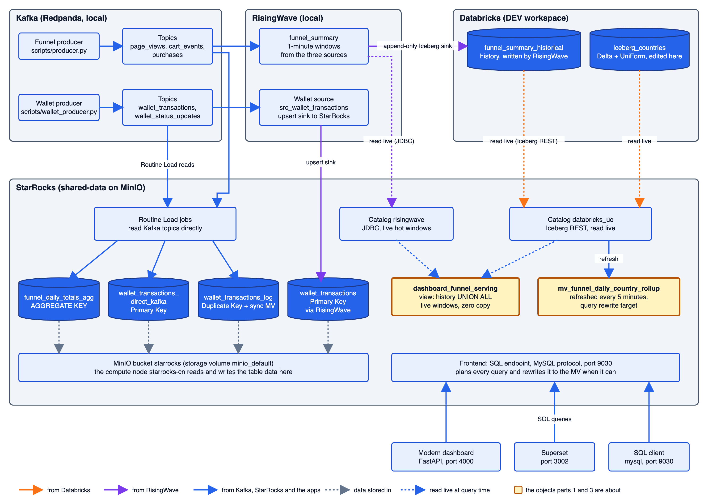

# StarRocks live demo: one SQL layer over live streams, Databricks and local tables

Date: 2026-10-11. Branch: `feature-sr`.

A script for demonstrating what StarRocks does in this stack, live, in about 25 minutes (core path) plus optional
segments. It is driven from Script Runner, Dagster, the modern dashboard, Superset and a SQL client.

StarRocks sits in front of the stack as the query layer. One SQL endpoint (the MySQL protocol, port 9030) reads live
RisingWave windows and Databricks history in a single query without copying either, rewrites queries to a
materialized view on its own, and holds its own tables with upserts, partial updates and storage-level aggregation.

This script was written from the StarRocks docs (`docs/SR_POC_*.md`, `docs/poc/STARROCKS_SERVING_LAYER.md`) and
checked against the code on 2026-10-11 (job names, model names, UI labels, endpoint fields). It was not run as one
continuous pass: each part was run separately while the demos were built, so do a dry run first. Several of the older
docs contain statements that later changes made stale; where that happened this script follows the code and says so.

## The parts

| Part | What it proves | Time | Needs |
|---|---|---|---|
| 1. Zero-copy hot and cold | One query spans RisingWave and Databricks, nothing copied, a Databricks edit shows up with no refresh | 8 min | funnel producer |
| 2. Graceful degradation | A RisingWave outage degrades the answer, visibly, instead of failing it | 4 min | funnel producer |
| 3. Query rewrite | The same SQL on a raw table runs against a materialized view, 10 to 35 times faster | 5 min | nothing |
| 4. Upserts and point lookups | A Primary Key table keeps the latest state of each transaction; updates, deletes and partial updates | 7 min | wallet producer |
| 5. Table models (optional) | A synchronous rollup MV and an `AGGREGATE KEY` table, with no refresh at all | 4 min | both producers |
| 6. Shared-data storage (optional) | StarRocks compute is separate from its storage, which lives in MinIO | 2 min | nothing |

Run part 2 after part 1 and on its own, because it breaks the hot path on purpose.

## The components

### Diagram



(The drawing is `img/starrocks_components.svg`, a plain-text SVG you can edit; the PNG is the same drawing exported
at 2x.) Arrow colours show where an arrow starts: orange from Databricks, purple from RisingWave, blue from Kafka,
StarRocks and the apps. Dotted arrows are reads made live at query time (grey ones show where data is stored). The two
yellow boxes are what parts 1 and 3 are about. The Superset, dashboard and SQL-client arrows all go to the one SQL
endpoint on port 9030.

An animated walkthrough of the data flow, 11 steps with a description of each, is in
[`starrocks_data_flow.html`](starrocks_data_flow.html) (open it in a browser). It follows the same path as this
script: events into Kafka, RisingWave windows, the append to Databricks, a query reaching StarRocks, the live reads
from both sides, a Databricks edit, the query rewrite, Routine Load, the upsert sink and the shared storage.

### StarRocks

| Object | What it is |
|---|---|
| `starrocks` (FE) and `starrocks-cn` (compute node) | Shared-data mode: table data is stored in the stack's MinIO (bucket `starrocks`, storage volume `minio_default`), not on local disk. MySQL protocol on port 9030. |
| Catalog `risingwave` | JDBC to RisingWave, `public` schema. The text protocol is forced (`binaryTransfer=false`) because the binary one returned corrupted timestamps. |
| Catalog `databricks_uc` | Iceberg REST against Unity Catalog `de_dev`. `iceberg_meta_cache_ttl_sec = 0`, so metadata is read fresh on every query. |
| Catalog `lakekeeper_local` | Iceberg REST against the local Lakekeeper and MinIO. |
| `starrocks-init` | Container that registers the three catalogs and the storage volume on every stack start (`starrocks/init_catalog.sh`). |

All the objects below are in the StarRocks database `sr_local_db_sr_local_db`.

| Object | Kind | What it does |
|---|---|---|
| `hot_funnel_summary` | view | Normalized view over `risingwave.public.funnel_summary`. |
| `dashboard_funnel_serving` | view | **The zero-copy serving view.** History from `databricks_uc...funnel_summary_historical` (one row per window and country) for windows older than RisingWave's oldest retained window, unioned with everything RisingWave has. |
| `dashboard_funnel_enriched` | view | The enriched and health metrics the dashboard shows. |
| `mv_funnel_daily_country_rollup` | async MV | Daily and country rollup of the Databricks table, refreshed every 5 minutes. The query-rewrite target (part 3). |
| `mv_unified_funnel_summary`, `mv_iceberg_countries_cache`, `dashboard_funnel_serving_cached` | MVs and a view | The earlier cached design, kept on purpose for the side-by-side comparison (part 1). The first is refreshed manually, the second every 20 seconds. |
| `funnel_daily_totals_agg` | `AGGREGATE KEY` table | Viewers, carters and purchasers summed at the storage layer by three Routine Load jobs on `page_views`, `cart_events` and `purchases`. |
| `wallet_transactions` | Primary Key table | Fed by a RisingWave upsert sink. |
| `wallet_transactions_direct_kafka` | Primary Key table | Same data from Kafka by Routine Load `wallet_direct_kafka_load`, no RisingWave. A second job, `wallet_status_update_load`, writes only the `status` column. |
| `wallet_transactions_log` and `mv_wallet_type_rollup` | Duplicate Key table and synchronous MV | Every event kept as a row; the rollup is maintained on every write. |
| `wallet_type_totals_agg` | `AGGREGATE KEY` table | Totals per type, used to show that gross and net totals differ. |

### Databricks (`de_dev.sr_poc_external`)

| Object | What it is |
|---|---|
| `funnel_summary_historical` | The history. RisingWave's append-only Iceberg sink writes one row per window revision, so the same window can appear several times; the serving view keeps the latest. External to the stack: it survives a full local teardown. |
| `iceberg_countries` | 20 rows of country codes and names. Delta with UniForm: you edit it with plain `UPDATE` in Databricks, and StarRocks reads the Iceberg metadata that Databricks generates a few seconds later. StarRocks cannot write to it. |

### Dagster, Script Runner and the apps

| Object | What it does |
|---|---|
| Job `starrocks_demo_setup_job` | **Builds everything for all the parts in one run.** It is the union of the two jobs below. Run it before starting any producer. |
| Job `modern_dashboard_setup_job` | RisingWave sources and sinks, the catalogs, all `dbt_starrocks` models, `funnel_daily_totals_agg` and the first refresh of the rewrite MV. |
| Job `wallet_pipeline_setup_job` | The wallet source, sink and the five wallet tables and jobs. |
| Script Runner (http://localhost:4001) | Buttons: **Start Services**, **Start Producer**, **Start Wallet Producer**, **Run Modern Dashboard**, **Stop Everything**. |
| Modern dashboard (http://localhost:4000) | **Queries** tab with an **Architecture** toggle (Live (zero-copy) or Cached); endpoint `/api/serving/status`. |
| Superset (http://localhost:3002) | Dashboards `funnel-dashboard`, `query-rewrite-demo` and `wallet-upsert-demo`, imported on every stack start from `superset/assets/export/`. |

### Where the code is

| Piece | File |
|---|---|
| Catalogs and the storage volume | `starrocks/init_catalog.sh` |
| The serving views and MVs | `dbt_starrocks/models/` |
| Jobs | `orchestration/definitions.py` |
| Wallet tables and Routine Load jobs | `orchestration/assets/wallet_direct_kafka_setup.py`, `wallet_sync_mv_setup.py`, `wallet_agg_key_setup.py` |
| Funnel `AGGREGATE KEY` table | `orchestration/assets/funnel_agg_key_setup.py` |
| Dashboard endpoints | `modern-dashboard/backend/api.py` |
| Producers | `scripts/producer.py`, `scripts/wallet_producer.py` |

## Before you start

- A **fresh** `devbox shell`. A shell left open since a previous session does not pick up `.env` changes, and
  Script Runner inherits it; `starrocks-init` then fails with a `must be set` error (see "If something goes wrong").
- Credentials for Databricks are in `.env`. The Superset login is in the project's `CLAUDE.md`.
- A Databricks SQL editor open on the DEV workspace, for the table edits.
- Two shell shortcuts:
  ```
  alias sr='docker exec -i starrocks mysql -h127.0.0.1 -P9030 -uroot'
  alias rw='psql -h localhost -p 4566 -U root -d dev'
  ```
- The images are already pulled. If the VPN has to be off to pull them, pull first, then reconnect: the Databricks
  steps need it on.

## 1. Start the stack and build everything (skip if already built)

1. Script Runner -> **Start Services**. Check that everything is `Up` or `healthy`:
   ```
   docker ps --format 'table {{.Names}}\t{{.Status}}'
   ```
2. Check the catalogs. All three must be listed next to `default_catalog`:
   ```
   sr -e "SHOW CATALOGS"
   ```
3. Dagster -> Jobs -> **`starrocks_demo_setup_job`** -> Launchpad -> Launch Run. Expect `RUN_SUCCESS`. Run it
   **before** any producer: it rebuilds `wallet_transactions` from scratch, and StarRocks refuses that while writers
   have transactions in flight.
4. Script Runner -> **Run Modern Dashboard**. The live view at http://localhost:4000 shows nothing ticking yet.

## 2. Part 1: zero-copy hot and cold (8 minutes)

The point: StarRocks answers from two live systems with nothing copied in between, and the history is not a snapshot.

1. **Query before the producer starts.** Queries tab, Architecture **Live (zero-copy)**, a time range that reaches
   back several days, Run. Only older windows come back (the Databricks history reaches 2026-09-14 and survives every
   teardown), and there is no Degraded banner: RisingWave is reachable, it just has nothing yet.
2. **Start the funnel producer.** Script Runner -> **Start Producer**, enter a TPS (for example 5). Wait **about 70
   seconds**: `funnel_summary` is a 1-minute tumbling window, so its first row appears only after the first window
   closes plus the source's 5-second watermark delay. The live view starts ticking at once; the query results do not.
3. **Query again.** The same range now also shows windows from the last few minutes, next to the old days.
4. **Show the sources.**
   ```
   curl -s http://localhost:4000/api/serving/status | python3 -m json.tool
   ```
   Expect `"status": "ready"`, no missing catalogs, and `freshness` with `hot_window` and `serving_window` populated.
5. **Show that it is one SQL statement over three systems**, in `sr`:
   ```sql
   SELECT COUNT(*) FROM risingwave.public.funnel_summary;                                  -- live
   SELECT COUNT(*) FROM databricks_uc.sr_poc_external.funnel_summary_historical;           -- Databricks
   SELECT window_start, country, viewers, carters, purchasers
   FROM sr_local_db_sr_local_db.dashboard_funnel_serving
   ORDER BY window_start DESC LIMIT 10;                                                    -- both, unioned
   ```
6. **Edit reference data in Databricks and watch it arrive.** First look at the value in `sr`:
   ```sql
   SELECT * FROM databricks_uc.sr_poc_external.iceberg_countries WHERE country = 'GR';   -- Greece
   ```
   In the Databricks SQL editor:
   ```sql
   UPDATE de_dev.sr_poc_external.iceberg_countries SET country_name = 'Hellas' WHERE country = 'GR';
   ```
   Wait about 8 seconds (Databricks generates the Iceberg metadata asynchronously) and run the `sr` query again: it
   says `Hellas`. Nobody ran a refresh in StarRocks. Put it back at the end of the demo (see "Clean up").
7. **Compare with the cached design.** On the Queries tab flip **Architecture** to **Cached** and run the same query:
   the label next to the run time names the architecture that produced it. In `sr`, the cached country copy is
   ```sql
   SELECT * FROM sr_local_db_sr_local_db.mv_iceberg_countries_cache WHERE country = 'GR';
   ```
   It catches up with the edit within 20 seconds, because the cache refreshes on a schedule.

**What to say**
- Zero copy means no refresh schedule, no cache and no "why did my edit not show up". The price is speed: the live
  query measured 1.4 to 2.6 seconds, the cached one 0.4 to 0.7 seconds (2026-09-08, same query, local single-node).
  Most of the live time is StarRocks planning queries against three external systems, not reading data.
- The hot and cold sides meet without a gap: the view takes history strictly older than RisingWave's oldest retained
  window and everything RisingWave has. This self-heals after a RisingWave restart. (The older runbook says a fixed
  3-minute boundary; the view stopped using it on 2026-09-10.)
- The cached history (`mv_unified_funnel_summary`) is refreshed by hand. If it looks stale:
  ```
  sr -e "REFRESH MATERIALIZED VIEW sr_local_db_sr_local_db.mv_unified_funnel_summary WITH SYNC MODE"
  ```

## 3. Part 2: graceful degradation (4 minutes)

Do this as its own segment, with the funnel producer running: it breaks the hot path on purpose.

1. **Baseline.** `curl -s http://localhost:4000/api/serving/status | python3 -m json.tool` shows `"status": "ready"`;
   run one query on the Queries tab (Live) and point out there is no banner.
2. **Break it.** Stop only the RisingWave SQL frontend, the thing StarRocks' JDBC catalog connects to:
   ```
   docker stop frontend-node-0
   ```
   The compute node and the Kafka sinks keep running.
3. **The live view is unaffected.** The main dashboard keeps updating: its SSE stream reads the backend's in-memory
   Kafka cache and touches neither StarRocks nor RisingWave's SQL layer.
4. **Run the query again** (the **Enriched** tab polls every 5 seconds and shows it by itself). The backend falls back
   to the Databricks history alone and marks the response `degraded: true`, and the red banner appears:
   "Degraded: the live RisingWave catalog is unavailable, showing cold/historical data only, results may be stale".
   `/api/serving/status` now reports `"status": "degraded"` with the failing queries under `component_errors`.
5. **Restore it.**
   ```
   docker start frontend-node-0
   ```
   Wait until it is healthy again (10 to 20 seconds): `docker ps --filter name=frontend-node-0 --format '{{.Status}}'`.
   Re-run the query: the banner is gone and the status is `ready`.

**What to say**
- The degradation is silent staleness, not an error page. That is deliberate, and it is why the banner exists: before
  it, nobody could tell fresh results from stale ones without reading the HTTP response.
- This failure mode was tested before (the isolated hot-catalog failure and the RisingWave frontend restart in
  `SR_POC_UNIFIED_PLAN.md`); you are reproducing it, not improvising.
- If StarRocks itself is the thing that is down there is no fallback: the aggregate endpoint returns HTTP 503. That
  was tested separately and is not part of this demo.

## 4. Part 3: transparent query rewrite (5 minutes)

The point: an analyst queries a raw Iceberg table, knows nothing about any materialized view, and StarRocks runs the
query against the view anyway.

Check the view is eligible first (the reason column does not exist on the current FE image, so it is left out):
```
sr -e "SELECT TABLE_NAME, IS_ACTIVE, QUERY_REWRITE_STATUS FROM information_schema.materialized_views WHERE TABLE_NAME='mv_funnel_daily_country_rollup'"
```
Expect `VALID`. Then, in a shell (each `sr` call is its own session, so the `SET` below lasts for one call only):
```bash
Q="SELECT date_trunc('day', window_start) AS day, country, SUM(viewers) AS viewers
   FROM databricks_uc.sr_poc_external.funnel_summary_historical GROUP BY day, country ORDER BY day"

# 1. the query only names the raw table; the plan goes to the MV
sr -e "EXPLAIN $Q" | grep -E "OlapScanNode|IcebergScanNode|MaterializedView"
time sr -e "$Q" > /dev/null

# 2. same SQL, rewrite off: the plan reads the Iceberg table
sr -e "SET enable_materialized_view_rewrite = false; EXPLAIN $Q" | grep -E "OlapScanNode|IcebergScanNode|MaterializedView"
time sr -e "SET enable_materialized_view_rewrite = false; $Q" > /dev/null
```
1. Show the query: it mentions only `funnel_summary_historical`.
2. First `EXPLAIN`: `OlapScanNode`, `mv_funnel_daily_country_rollup`, `MaterializedView: true`. "The query never asked for
   this table."
3. Rewrite off: `IcebergScanNode` and a much larger row count. Same SQL, same answer, different plan.
4. Compare the two `time` outputs. Measured 2026-09-06: 0.05 to 0.15 seconds with the rewrite, 1.8 to 5.5 seconds
   without (20 to 35 times). Measured through Superset on a later, larger table: about 0.6 seconds against 7.2 seconds.
5. Optional: Superset -> **StarRocks Query Rewrite Demo** shows the two runs side by side. The "off" chart uses a
   separate Superset connection with rewrite disabled for the whole session, because Superset strips a hint written
   in the SQL text.

**What to say**
- An analyst or BI tool that only knows the raw table gets the speedup by itself.
- It needs a stable query shape: the other MV in this project (a union with `CURRENT_TIMESTAMP()` filters) is
  refused (`UNSUPPORTED_DEFINITION`). Rewrite is not a blanket capability.
- The MV refreshes every 5 minutes (a refresh takes 20 to 46 seconds whatever the tuning), so two runs several
  minutes apart can differ, and a query that lands inside a refresh can be slow.
- The numbers are single local runs at small volume. Do not quote the multiplier as a hard number.

## 5. Part 4: upserts and point lookups (7 minutes)

The point: StarRocks Primary Key tables keep the latest state of each key, and they take updates in several ways.

1. Script Runner -> **Start Wallet Producer**, enter a TPS (for example 5). One producer feeds all the paths below:
   it writes `wallet_transactions` events and, separately, `wallet_status_updates`. About 20% of transactions get a
   reversal event 5 seconds later (the amount is the negative of the original), and some of the rest get a
   status-only event after about 8 seconds.
2. Open Superset -> **Wallet Upsert Demo** (`/superset/dashboard/wallet-upsert-demo/`).
3. **Upsert.** Every reversed transaction produced two Kafka events and still has one row:
   ```sql
   SELECT COUNT(*), COUNT(DISTINCT transaction_id) FROM sr_local_db_sr_local_db.wallet_transactions;
   ```
   The two numbers are equal.
4. **Point lookup.** Take a reversed row and fetch it by key; it comes back in about 90 ms including the `docker exec`:
   ```sql
   SELECT transaction_id FROM sr_local_db_sr_local_db.wallet_transactions WHERE status = 'reversed' LIMIT 1;
   SELECT * FROM sr_local_db_sr_local_db.wallet_transactions WHERE transaction_id = '<that id>';
   ```
   It shows only the reversed state.
5. **With and without RisingWave.** Run step 3 on `wallet_transactions_direct_kafka` too: same invariant, but this
   table is fed straight from Kafka by a Routine Load job. In Superset the two point-lookup tables sit side by side.
6. **Partial update.** A separate writer sends only `{transaction_id, status}`. On the direct table:
   ```sql
   SELECT transaction_id, account_id, type, amount, status, event_time
   FROM sr_local_db_sr_local_db.wallet_transactions_direct_kafka WHERE status = 'flagged' LIMIT 5;
   ```
   `status` is `flagged` while the other columns are exactly as first written: that writer never saw them.
7. **Plain SQL, no pipeline.** Pick a row that is `settled` and older than about 10 seconds (past both the reversal
   and the status-update windows), otherwise the producer's own late event can overwrite what you just showed:
   ```sql
   UPDATE sr_local_db_sr_local_db.wallet_transactions SET status = 'under_review' WHERE transaction_id = '<id>';
   DELETE FROM sr_local_db_sr_local_db.wallet_transactions WHERE transaction_id = '<id>';
   ```
   `COUNT(*)` drops by exactly one and still equals `COUNT(DISTINCT transaction_id)`. Only Primary Key tables allow
   this; Duplicate, Aggregate and Unique Key tables have no ad-hoc `UPDATE` or `DELETE`.

**What to say**
- This mirrors a proposal to serve upsert-heavy wallet reads from StarRocks fed from Kafka. The demo shows the
  mechanism. It does not test the proposal's targets (P99 under 100 ms under load, billions of events a month).
  One lookup on one local node says nothing about load.
- The two ingestion paths have the same lag, about 3 seconds (12 samples: 2.97 s through RisingWave, 3.36 s direct).
  The difference is architectural: one fewer moving part, for a pipeline that uses none of RisingWave's processing.
- The 3-second lag needed `commit_checkpoint_interval = 1` on the RisingWave sink, which gives up sink buffering.
  Right for a demo, wrong for a pipeline whose target might stall.

## 6. Part 5: table models, optional (4 minutes)

1. **Synchronous rollup MV.** Query the base table, never the rollup by name:
   ```bash
   sr -e "SELECT type, SUM(amount) AS total_amount, COUNT(transaction_id) AS event_count FROM sr_local_db_sr_local_db.wallet_transactions_log GROUP BY type"
   sr -e "EXPLAIN SELECT type, SUM(amount), COUNT(transaction_id) FROM sr_local_db_sr_local_db.wallet_transactions_log GROUP BY type" | grep -i rollup
   ```
   Expect `rollup: mv_wallet_type_rollup`. Run the first query twice, a few seconds apart: the numbers move and there
   is no `REFRESH` to run, because there is none to run. Every other MV in this project is asynchronous.
2. **`AGGREGATE KEY`, funnel side** (funnel producer running):
   ```sql
   SELECT * FROM sr_local_db_sr_local_db.funnel_daily_totals_agg;
   ```
   Run it twice 10 seconds apart: `viewers`, `carters` and `purchasers` grow, with no MV and no `GROUP BY` at query
   time. Three Routine Load jobs each add to their own column of the same row.
3. **Why gross and net differ** (wallet side): `wallet_type_totals_agg` is also an `AGGREGATE KEY` table, and its
   `bet`, `win` and `deposit` totals are higher than the Primary Key table's, by exactly the reversed ones. A
   reversal has the type `reversal`, a different key, so a sum cannot net it out; the Primary Key table's upsert
   moves the transaction out of `bet` altogether. Same question, structurally different answers.

## 7. Part 6: shared-data storage, optional (2 minutes)

For an infrastructure audience. StarRocks runs as a frontend plus a compute node (`starrocks-cn`), and its own
tables live in MinIO:
```bash
sr -e "SHOW COMPUTE NODES"
sr -e "SHOW STORAGE VOLUMES"
```
The MinIO console (http://localhost:9400) shows the objects StarRocks wrote under the `starrocks` bucket.

- Adding a compute node does not rebalance any data, unlike the earlier shared-nothing setup.
- The same setup on Azure (ADLS) is feasible but blocked: StarRocks' ADLS2 storage volume only accepts managed or
  workload identity, not a client secret. MinIO's static keys just work.
- `Stop Everything` removes the MinIO volume, and with it StarRocks' tables.

## 8. Clean up

- **Put the country back:** in the Databricks SQL editor,
  ```sql
  UPDATE de_dev.sr_poc_external.iceberg_countries SET country_name = 'Greece' WHERE country = 'GR';
  ```
- If part 2 left it stopped: `docker start frontend-node-0`.
- Script Runner -> **Stop Everything** stops the containers and both producers. It also wipes the local volumes
  (RisingWave, MinIO and so the StarRocks tables). The Databricks tables are external and stay. The Superset volume
  is kept, and the dashboards are re-imported on the next start.
- Rebuilding with `wallet_pipeline_setup_job` or `starrocks_demo_setup_job` empties `wallet_transactions` (dbt drops
  and recreates it); start the wallet producer again afterwards.

## Talking points

- **Lead with parts 1 and 3.** They show StarRocks doing what a single database or a plain Iceberg engine cannot:
  live federation across systems with no ETL, and speedups with no query changes. Part 6 is for an operations
  audience.
- **Be ready to say where it does not fit.** The evaluation found three poor fits:
  - Latency-sensitive, high-frequency point reads or writes. A StarRocks-backed ML prediction path was built and
    reverted the same day, and routing near-1/second RisingWave reads through the JDBC catalog was rejected because
    each external-catalog touch costs hundreds of milliseconds to about 2 seconds of planning.
  - Frequent small-batch streaming sinks. A native RisingWave sink on the funnel (checkpoints about every 4
    seconds) overloaded StarRocks' compaction and made queries slower.
  - Putting StarRocks in the path only to add resilience, with no real consumer of the extra query surface.
- **The cost of zero copy** is the 1.4 to 2.6 seconds per query; the cached architecture is faster and stale by
  design. The Architecture toggle exists so you can show both and let the audience choose.
- **BI tools** connect for free (MySQL protocol, so Power BI or Tableau), but no demo of that has been built.

## Not shown or tested

- Latency and concurrency at production volume. The only baseline is 32 requests per endpoint with 8 workers on one
  local node (p95 between 0.57 and 0.96 seconds), which is not an acceptance threshold.
- The proposal's targets for point lookups under load, and a day and night soak of the hot and cold boundary.
- Late arrivals, replayed windows and duplicate boundaries.
- Shared-data on Azure, and a BI-tool connection.
- Any real customer or payment data: the wallet producer is fully synthetic.

## If something goes wrong

| Symptom | Cause and fix |
|---|---|
| Setup job fails with `Kafka topic 'funnel' is unavailable` | The preflight needs the topic before the sink creates it. Create it: `docker exec redpanda rpk topic create funnel --brokers redpanda:9092`, then re-run. |
| Several StarRocks-catalog assets fail together after `Start Services` | `docker logs starrocks-init`: a `must be set` error means Script Runner was started from an old devbox shell. Stop Script Runner, open a new devbox shell, start Script Runner from it, run **Start Services** again, then check `SHOW CATALOGS`. |
| Setup job fails dropping `wallet_transactions` | A producer or Routine Load job has transactions in flight. Nothing is lost; stop the wallet producer and retry. |
| Queries tab shows an error with a message about the planner time | The planner timeout (`new_planner_optimize_timeout`, set to 15000 ms by `init_catalog.sh`) was reset. `sr -e "SET GLOBAL new_planner_optimize_timeout = 15000"`. |
| `QUERY_REWRITE_STATUS` is not `VALID`, or `EXPLAIN` shows `IcebergScanNode` with rewrite on | The MV is inactive or was never refreshed: `sr -e "REFRESH MATERIALIZED VIEW sr_local_db_sr_local_db.mv_funnel_daily_country_rollup WITH SYNC MODE"`. |
| Both Superset rewrite charts are equally fast | The "off" chart is using the normal connection. It must use the "StarRocks (rewrite disabled)" connection. |
| A Superset chart errors instead of showing data | Check the table directly first (`SELECT COUNT(*)`): usually a setup step has not run or has not produced data yet. |
| A Databricks edit does not show | UniForm needs about 8 seconds; then check the `databricks_uc` catalog has `iceberg_meta_cache_ttl_sec = 0`. In Cached mode the country copy refreshes every 20 seconds. |
| Timestamps of `2000-01-01` from `risingwave.public.funnel_summary` | The JDBC catalog lost `binaryTransfer=false`; `init_catalog.sh` drops and recreates the catalog on every start, so fix it there. |
| Do not lower Delta retention on `funnel_summary_historical` | A 1-hour retention raced against the live sink and Predictive Optimization's automatic `VACUUM` on 2026-09-14 and deleted files: 17 rows were lost for good. Leave `delta.deletedFileRetentionDuration` and `delta.logRetentionDuration` at their defaults. |
| Run jobs with `dg launch` from the host and it hangs on a Docker hostname | The host's DNS resolves `frontend-node-0` to a wrong address. Launch through the Dagster UI, which runs inside the Docker network. |

## Source docs

| Topic | Doc |
|---|---|
| Architecture and the failure tests | `docs/SR_POC_UNIFIED_PLAN.md` |
| Run instructions for the first demos | `docs/SR_POC_LIVE_DEMO_RUNBOOK.md`, `docs/SR_POC_SUPERSET_DEMOS_RUNBOOK.md` |
| Zero copy, the cached comparison, the country table | `docs/SR_POC_ICEBERG_COUNTRIES_MIGRATION.md` |
| Query rewrite and the 2026-09-14 incident | `docs/SR_POC_QUERY_REWRITE_DEMO.md` |
| Primary Key, partial update, synchronous MV | `docs/SR_POC_WALLET_UPSERT_DEMO.md` |
| `AGGREGATE KEY` on the funnel | `docs/SR_POC_FUNNEL_AGGREGATE_KEY_DEMO.md` |
| Shared-data storage | `docs/SR_POC_STARROCKS_SHARED_DATA_MINIO.md`, `docs/SR_POC_STARROCKS_SHARED_DATA_AZURE.md` |
| Where it helps and where it does not | `docs/SR_POC_STARROCKS_EVALUATION_SUMMARY.md` |
