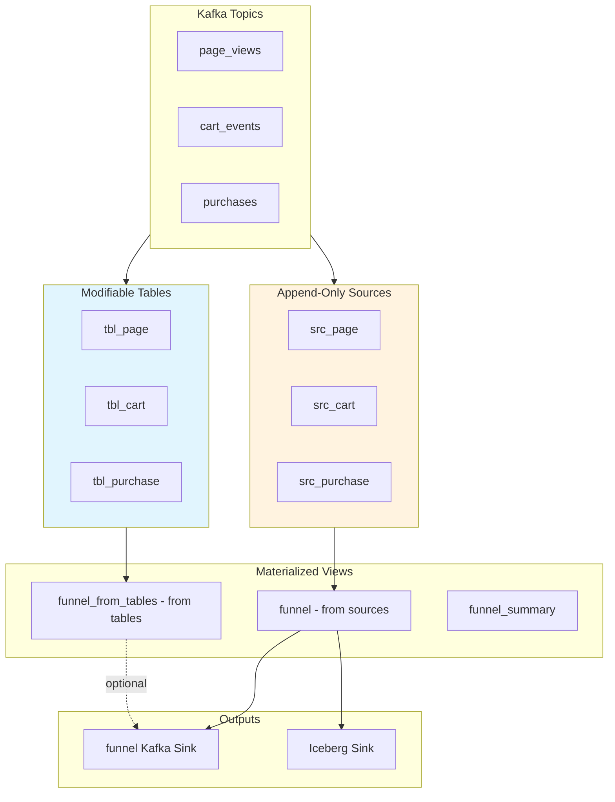

# Plan: Adding Kafka Tables for UPDATE/DELETE Support

## Overview
Add RisingWave Kafka TABLE models alongside existing SOURCE models to enable UPDATE/DELETE operations for demos.

## Current State
- **src_cart.sql**, **src_page.sql**, **src_purchase.sql**: CREATE SOURCE (append-only, non-modifiable)
- **funnel.sql**: Materialized view aggregating from sources
- **funnel_summary.sql**: 1-minute window aggregation

## Proposed Changes

### 1. New Materialization Macro: `kafka_table.sql`

**File**: `dbt/macros/materializations/kafka_table.sql`

```jinja2
{#
  Materialization: kafka_table
  Purpose: Creates RisingWave tables with Kafka connector for modifiable streaming data
  Usage: {{ config(materialized='kafka_table') }}
  
  Unlike CREATE SOURCE, these tables:
  - Store data internally (not just a connector)
  - Support UPDATE and DELETE operations
  - Can have PRIMARY KEY for upserts
#}


    {# Get config values #}
    
    
    
    
    
    

    {# Get the target relation #}
    

    {# Drop and recreate for full refresh #}
    
        
            DROP TABLE IF EXISTS {{ table_name }} CASCADE;
        
        {{ log("Dropped table " ~ table_name ~ " for full refresh", info=True) }}
    

    {# Build the CREATE TABLE SQL from the model's SQL #}
    
        {{ sql }}
    

    {{ log("Creating Kafka table: " ~ table_name, info=True) }}

    {# Execute the create table statement #}
    
        {{ create_table_sql }}
    

    {{ log("✓ Kafka table '" ~ table_name ~ "' created successfully", info=True) }}

    {{ return({'relations': [target_relation]}) }}


```

### 2. New Table Models

#### `dbt/models/tbl_cart.sql`
```sql
{{ config(
    materialized='kafka_table',
    topic='cart_events',
    primary_key='user_id',
    bootstrap_servers='redpanda:9092',
    scan_startup_mode='earliest'
) }}

CREATE TABLE IF NOT EXISTS {{ this }} (
    user_id int,
    item_id varchar,
    event_time timestamptz,
    PRIMARY KEY (user_id)
) WITH (
    connector = 'kafka',
    topic = 'cart_events',
    properties.bootstrap.server = 'redpanda:9092',
    scan.startup.mode = 'earliest'
) FORMAT PLAIN ENCODE JSON
```

#### `dbt/models/tbl_page.sql`
```sql
{{ config(
    materialized='kafka_table',
    topic='page_views',
    primary_key='user_id',
    bootstrap_servers='redpanda:9092',
    scan_startup_mode='earliest'
) }}

CREATE TABLE IF NOT EXISTS {{ this }} (
    user_id int,
    page_id varchar,
    event_time timestamptz,
    PRIMARY KEY (user_id)
) WITH (
    connector = 'kafka',
    topic = 'page_views',
    properties.bootstrap.server = 'redpanda:9092',
    scan.startup.mode = 'earliest'
) FORMAT PLAIN ENCODE JSON
```

#### `dbt/models/tbl_purchase.sql`
```sql
{{ config(
    materialized='kafka_table',
    topic='purchases',
    primary_key='user_id',
    bootstrap_servers='redpanda:9092',
    scan_startup_mode='earliest'
) }}

CREATE TABLE IF NOT EXISTS {{ this }} (
    user_id int,
    amount DOUBLE,
    event_time timestamptz,
    PRIMARY KEY (user_id)
) WITH (
    connector = 'kafka',
    topic = 'purchases',
    properties.bootstrap.server = 'redpanda:9092',
    scan.startup.mode = 'earliest'
) FORMAT PLAIN ENCODE JSON
```

### 3. New Funnel Model Using Tables

#### `dbt/models/funnel_from_tables.sql`
```sql
{{ config(materialized='materialized_view') }}

WITH stats AS (
    SELECT
        window_start,
        window_end,
        count(distinct p.user_id) as viewers,
        count(distinct c.user_id) as carters,
        count(distinct pur.user_id) as purchasers
    FROM TUMBLE({{ ref('tbl_page') }}, event_time, INTERVAL '20 SECOND') p
    LEFT JOIN {{ ref('tbl_cart') }} c
        ON p.user_id = c.user_id
        AND c.event_time BETWEEN p.window_start AND p.window_end
    LEFT JOIN {{ ref('tbl_purchase') }} pur
        ON p.user_id = pur.user_id
        AND pur.event_time BETWEEN p.window_start AND p.window_end
    GROUP BY window_start, window_end
)

SELECT
    window_start,
    window_end,
    viewers,
    carters,
    purchasers,
    round(coalesce(carters::numeric / nullif(viewers, 0), 0), 2) as view_to_cart_rate,
    round(coalesce(purchasers::numeric / nullif(carters, 0), 0), 2) as cart_to_buy_rate
FROM stats
```

### 4. Demo SQL: UPDATE/DELETE Operations

#### `dbt/models/demo_operations.sql` (ephemeral model with documentation)
```sql
-- This model provides documentation and example SQL for demo operations
-- Run these manually via psql or a SQL client

/*
-- Example 1: Update a user's cart item
UPDATE tbl_cart 
SET item_id = 'premium-widget', event_time = NOW() 
WHERE user_id = 123;

-- Example 2: Delete a specific user from page views
DELETE FROM tbl_page 
WHERE user_id = 456;

-- Example 3: Update purchase amount
UPDATE tbl_purchase 
SET amount = 99.99, event_time = NOW() 
WHERE user_id = 789;

-- Example 4: Insert a new record directly
INSERT INTO tbl_cart (user_id, item_id, event_time) 
VALUES (999, 'demo-item', NOW());

-- Example 5: View the effects on the funnel
SELECT * FROM funnel_from_tables 
ORDER BY window_start DESC 
LIMIT 10;

-- Example 6: Compare with source-based funnel
SELECT 
    s.window_start,
    s.viewers as source_viewers,
    t.viewers as table_viewers,
    s.carters as source_carters,
    t.carters as table_carters
FROM funnel s
FULL OUTER JOIN funnel_from_tables t 
    ON s.window_start = t.window_start
ORDER BY COALESCE(s.window_start, t.window_start) DESC
LIMIT 10;
*/

SELECT 1 as demo_placeholder
```

### 5. Updated `dbt_project.yml`

```yaml
name: 'realtime_funnel'
version: '1.0.0'
config-version: 2

profile: 'funnel_profile'

model-paths: ["models"]
target-path: "target"
macro-paths: ["macros"]

models:
  realtime_funnel:
    +materialized: materialized_view
    +schema: public
    
    # Keep sources in their own folder if desired
    sources:
      +materialized: source
    
    # Kafka tables for modifiable data
    kafka_tables:
      +materialized: kafka_table
      +tags: ['kafka', 'modifiable']

vars:
  iceberg_catalog_uri: 'http://lakekeeper:8181/catalog/'
  iceberg_warehouse: 'risingwave-warehouse'
  iceberg_namespace: 'public'
  s3_endpoint: 'http://minio-0:9301'
  s3_access_key: 'hummockadmin'
  s3_secret_key: 'hummockadmin'
  s3_region: 'us-east-1'

# Model execution order:
# 1. src_*.sql (sources) - Kafka sources (append-only)
# 2. tbl_*.sql (kafka_table) - Kafka tables (modifiable with PRIMARY KEY)
# 3. funnel.sql (materialized_view) - Funnel from sources
# 4. funnel_from_tables.sql (materialized_view) - Funnel from tables
# 5. iceberg_funnel_table.sql (iceberg_table) - Iceberg table
# 6. sink_funnel_to_iceberg.sql (sink) - Sink to Iceberg
# 7. sink_funnel_to_kafka.sql (sink) - Sink to Kafka
```

## Architecture Diagram



## Key Differences: SOURCE vs TABLE

| Feature | CREATE SOURCE | CREATE TABLE WITH connector |
|---------|---------------|----------------------------|
| **Storage** | No internal storage | Stores data internally |
| **Modifiable** | No - read-only | Yes - supports UPDATE/DELETE |
| **PRIMARY KEY** | No | Yes - enables upserts |
| **Use Case** | Raw ingestion | Processing, enrichment, corrections |
| **Query Speed** | Reads from Kafka | Reads from internal storage (faster) |
| **Resource Usage** | Lower | Higher (stores data) |

## Demo Scenarios

### Scenario 1: Correct Erroneous Data
```sql
-- A purchase was recorded with wrong amount
UPDATE tbl_purchase 
SET amount = 150.00 
WHERE user_id = 123 AND amount = 1500.00;

-- The funnel_from_tables MV will automatically reflect this change
```

### Scenario 2: Remove Test Data
```sql
-- Remove test user data
DELETE FROM tbl_cart WHERE user_id = 99999;
DELETE FROM tbl_page WHERE user_id = 99999;
DELETE FROM tbl_purchase WHERE user_id = 99999;
```

### Scenario 3: Enrich Existing Data
```sql
-- Add a flag for VIP users (requires schema change or new table)
ALTER TABLE tbl_cart ADD COLUMN is_vip BOOLEAN DEFAULT false;
UPDATE tbl_cart SET is_vip = true WHERE user_id IN (SELECT user_id FROM vip_users);
```

## Implementation Checklist

- [ ] Create `dbt/macros/materializations/kafka_table.sql`
- [ ] Create `dbt/models/tbl_cart.sql`
- [ ] Create `dbt/models/tbl_page.sql`
- [ ] Create `dbt/models/tbl_purchase.sql`
- [ ] Create `dbt/models/funnel_from_tables.sql`
- [ ] Create `dbt/models/demo_operations.sql` (documentation)
- [ ] Update `dbt_project.yml` with new execution order
- [ ] Test dbt run to ensure all models compile
- [ ] Verify UPDATE/DELETE operations work
- [ ] Verify downstream MVs update correctly

## Files to Create

1. `dbt/macros/materializations/kafka_table.sql` - New materialization
2. `dbt/models/tbl_cart.sql` - Cart events table
3. `dbt/models/tbl_page.sql` - Page views table
4. `dbt/models/tbl_purchase.sql` - Purchase events table
5. `dbt/models/funnel_from_tables.sql` - New funnel MV
6. `dbt/models/demo_operations.sql` - Demo SQL examples

## Files to Modify

1. `dbt/dbt_project.yml` - Update model configuration and execution order

## Notes

- Tables with PRIMARY KEY will upsert on duplicate keys from Kafka
- Without PRIMARY KEY, inserts are always appended
- The existing src_* models remain unchanged for backward compatibility
- Both funnel and funnel_from_tables can coexist for comparison
