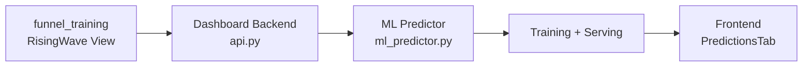
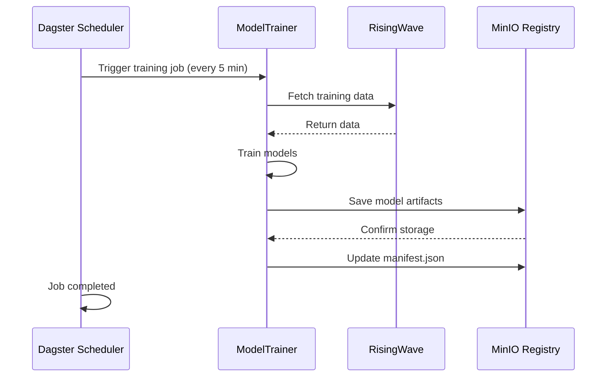
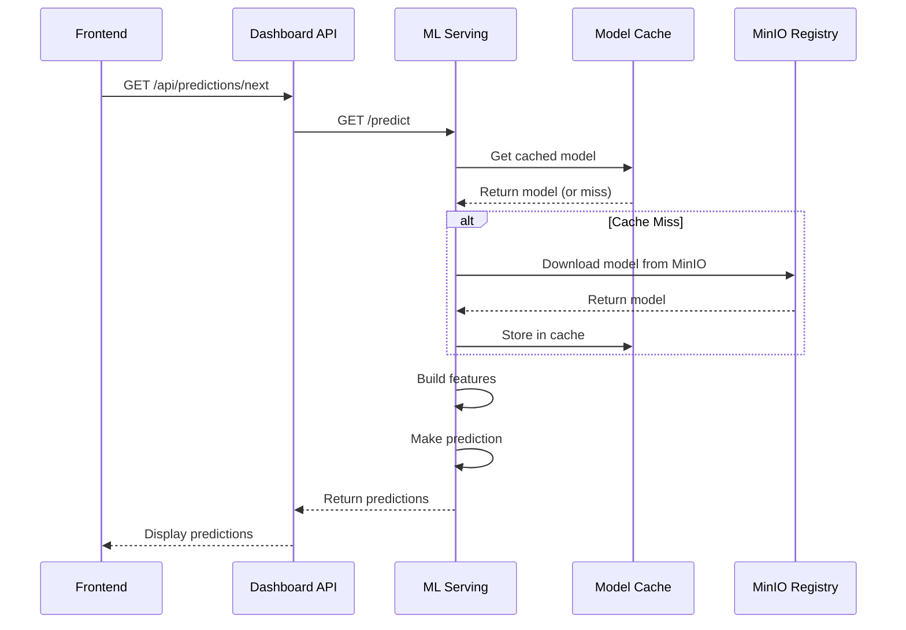
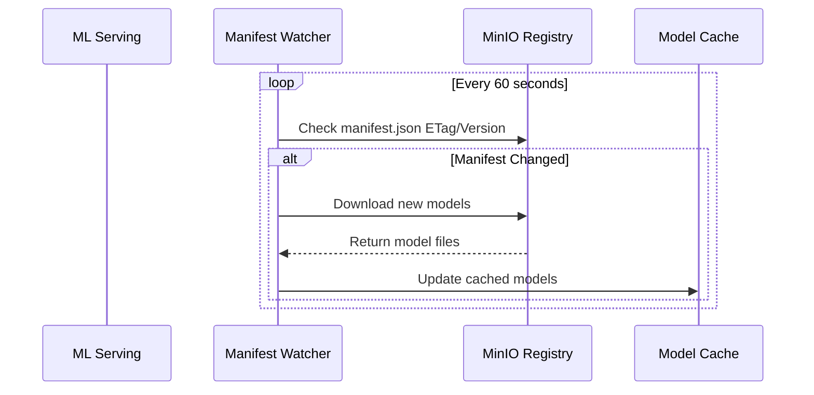

# ML Training/Serving Separation Plan

## Current Architecture Overview

Currently, the ML predictor is a monolithic component within the dashboard backend that handles both training and serving:



**Current Issues:**
- Training and serving are coupled in the same process
- Training consumes resources during prediction requests
- No versioning of trained models
- Cannot scale training and serving independently
- No persistence of trained models between restarts

---

## Proposed Architecture

### High-Level Design

```mermaid
graph TB
    subgraph Data Layer
        RW[funnel_training<br/>RisingWave View]
    end

    subgraph ML Training<br/>Dagster Scheduled Job
        DJ[Dagster Job<br/>ml_training_job]
        TR[Trainer<br/>scikit-learn]
        MR[Model Registry<br/>MinIO]
    end

    subgraph ML Serving<br/>Script Runner Managed
        SV[ML Serving Service<br/>FastAPI]
        PR[Predictor API]
        CM[Model Cache]
    end

    subgraph Consumer
        FB[Dashboard Backend<br/>api.py]
        FE[Frontend<br/>PredictionsTab]
    end

    RW -->|Fetch Training Data| TR
    TR -->|Save Model Artifacts| MR
    MR -->|Load Models| SV
    SV -->|HTTP API| FB
    FB -->|WebSocket/HTTP| FE
    DJ -->|Trigger| TR
```

---

## Component Details

### 1. ML Training Module (`ml/training/`)

**Purpose:** Python module containing training logic, executed by Dagster on a schedule

**Deployment:** Runs as a Dagster job with configurable scheduling:
- **Standard Mode:** Cron schedule every 5 minutes (production)
- **Realtime Demo Mode:** Sensor-based every 20 seconds (demos)

**Key Responsibilities:**
- Fetch training data from RisingWave
- Train models for all metrics
- Version and save model artifacts to local filesystem
- Track training metrics

**Directory Structure:**
```
ml/
├── __init__.py
├── training/
│   ├── __init__.py
│   ├── trainer.py           # Core training logic
│   ├── data_fetcher.py      # RisingWave data access
│   └── model_registry.py    # Local filesystem storage
├── serving/
│   ├── __init__.py
│   ├── main.py              # FastAPI application
│   ├── predictor.py         # Prediction logic
│   └── model_loader.py      # Model loading from registry
└── models/                  # Model artifacts storage
    ├── viewers/
    │   ├── v20260305_120000.pkl
    │   └── latest.json
    ├── carters/
    ├── purchasers/
    ├── view_to_cart_rate/
    ├── cart_to_buy_rate/
    └── manifest.json        # Global manifest
```

**Key Classes:**

```python
# ml/training/trainer.py
class ModelTrainer:
    """Handles model training and evaluation."""
    
    def train_all_metrics(self) -> TrainingResult:
        """Train models for all metrics and return results."""
        pass
    
    def evaluate_model(self, model, test_data) -> Metrics:
        """Evaluate model performance."""
        pass

# ml/training/model_registry.py
class ModelRegistry:
    """Manages model artifact storage to MinIO S3-compatible storage."""
    
    BUCKET_NAME = "ml-models"
    
    def __init__(self):
        self.s3_client = boto3.client(
            's3',
            endpoint_url=os.getenv('MINIO_ENDPOINT', 'http://localhost:9301'),
            aws_access_key_id=os.getenv('MINIO_ACCESS_KEY', 'hummockadmin'),
            aws_secret_access_key=os.getenv('MINIO_SECRET_KEY', 'hummockadmin'),
            region_name='us-east-1'
        )
    
    def save_model(self, model, metric: str, metadata: dict) -> ModelVersion:
        """Save model artifact to MinIO and update manifest."""
        pass
    
    def get_latest_model(self, metric: str) -> Optional[ModelArtifact]:
        """Retrieve latest model for a metric from MinIO."""
        pass
    
    def list_versions(self, metric: str) -> List[ModelVersion]:
        """List available model versions."""
        pass
```

---

### 2. ML Serving Service (`ml/serving/`)

**Purpose:** Lightweight prediction API that runs as a background service

**Deployment:** Started/stopped via script runner (like the dashboard)

**Key Responsibilities:**
- Load and cache trained models from local filesystem
- Serve prediction requests with low latency
- Health checks and model status reporting
- Auto-reload models when new versions available

**Key Classes:**

```python
# ml/serving/predictor.py
class ModelPredictor:
    """Handles model predictions with caching."""
    
    def predict(self, metric: str, features: Features) -> Prediction:
        """Make prediction using cached model."""
        pass
    
    def get_model_status(self) -> Dict[str, ModelStatus]:
        """Return status of all loaded models."""
        pass

# ml/serving/model_loader.py
class ModelLoader:
    """Loads models from registry with hot-reloading."""
    
    def load_latest_models(self) -> Dict[str, Model]:
        """Load latest models from registry."""
        pass
    
    def check_for_updates(self) -> bool:
        """Check if new models are available."""
        pass
```

---

### 3. Model Registry (MinIO Storage)

**Storage Location:** MinIO bucket `ml-models`

**Storage Structure:**

Version format: `vYYYYMMDD_HHMMSS` (e.g., `v20260305_120000` = March 5, 2026 at 12:00:00)

```
ml-models/
├── viewers/
│   ├── v20260305_120000.pkl              # Model trained at 12:00:00
│   ├── v20260305_120000_scaler.pkl
│   └── v20260305_120000_metadata.json
├── carters/
├── purchasers/
├── view_to_cart_rate/
├── cart_to_buy_rate/
└── manifest.json          # Global manifest with latest versions
```

**Metadata Schema:**

```json
{
  "metric": "viewers",
  "version": "v20260305_120000",          // Version contains HHMMSS for easy display
  "trained_at": "2026-03-05T12:00:00Z",   // ISO timestamp for precise tracking
  "model_type": "RandomForestRegressor",
  "file_path": "viewers/v20260305_120000.pkl",
  "scaler_path": "viewers/v20260305_120000_scaler.pkl",
  "metrics": {
    "mae": 5.23,
    "r2": 0.89
  },
  "training_samples": 45,
  "feature_columns": [...]
}
```

**Global Manifest:**
```json
{
  "last_updated": "2026-03-05T12:00:00Z",
  "latest_versions": {
    "viewers": "v20260305_120000",
    "carters": "v20260305_120000",
    "purchasers": "v20260305_120000",
    "view_to_cart_rate": "v20260305_120000",
    "cart_to_buy_rate": "v20260305_120000"
  }
}
```

---

## API Contracts

### Serving Service API

**Public API** (used by dashboard backend):

| Endpoint | Method | Description |
|----------|--------|-------------|
| `/health` | GET | Health check with model status |
| `/predict` | POST | Get predictions for all metrics |
| `/predict/{metric}` | POST | Get prediction for specific metric |
| `/models` | GET | List loaded models and versions |
| `/reload` | POST | Force model reload from registry |

**Example: Get Predictions**
```bash
GET http://localhost:8001/predict

Response:
{
  "predicted_at": "2026-03-05T12:00:00Z",
  "timestamp": "2026-03-05T12:01:00Z",
  "viewers": {
    "value": 145.3,
    "confidence": 0.85,
    "model_version": "v20260305_120000"
  },
  "carters": {
    "value": 42.1,
    "confidence": 0.82,
    "model_version": "v20260305_120000"
  }
}
```

**Example: Model Status**
```bash
GET http://localhost:8001/models

Response:
{
  "models": {
    "viewers": {
      "loaded": true,
      "version": "v20260305_120000",
      "loaded_at": "2026-03-05T12:00:05Z",
      "model_type": "RandomForestRegressor"
    }
  },
  "last_reload": "2026-03-05T12:00:05Z"
}
```

### Frontend Display Example

The frontend can parse the version to show training time:

```jsx
// PredictionsTab.jsx - Display model version
function formatModelVersion(version) {
    // v20260305_120000 -> "12:00:00"
    const match = version.match(/v\d{8}_(\d{2})(\d{2})(\d{2})/);
    if (match) {
        return `${match[1]}:${match[2]}:${match[3]}`;
    }
    return version;
}

// In component
<span className="model-version">
    Model: {formatModelVersion(prediction.model_version)}
</span>
// Displays: "Model: 12:00:00"
```

---

## Deployment Strategy

### 1. Dagster Integration for Training

Add ML training job to [`orchestration/definitions.py`](orchestration/definitions.py):

```python
# orchestration/definitions.py

from ml.training.trainer import ModelTrainer
from ml.training.model_registry import ModelRegistry

@asset(group_name="ml")
def ml_trained_models(context: AssetExecutionContext):
    """Train ML models on funnel data."""
    context.log.info("Starting ML model training...")
    
    trainer = ModelTrainer()
    results = trainer.train_all_metrics()
    
    context.log.info(f"Trained {len(results.models)} models")
    for metric, result in results.models.items():
        context.log.info(f"  {metric}: MAE={result.mae:.2f}, R²={result.r2:.3f}")
    
    return {
        "trained_models": list(results.models.keys()),
        "trained_at": datetime.now(timezone.utc).isoformat()
    }

# Schedule Options

## Option 1: Standard Schedule (5 minutes - Production)
ml_training_schedule = ScheduleDefinition(
    job=define_asset_job(
        name="ml_training_job",
        selection=[ml_trained_models],
        description="Train ML models every 5 minutes"
    ),
    cron_schedule="*/5 * * * *",
    name="ml_training_schedule",
)

## Option 2: Realtime Demo Schedule (20 seconds - Demo Mode)
# Dagster sensors support minimum_interval_seconds as low as 1 second
# but practical minimum is ~20 seconds for this use case
from dagster import sensor, RunRequest

@sensor(
    job=define_asset_job(name="ml_training_job_realtime", selection=[ml_trained_models]),
    minimum_interval_seconds=20,  # 20 second intervals
    name="ml_training_realtime_sensor"
)
def ml_training_realtime_sensor(context):
    """
    High-frequency training sensor for realtime demos.
    
    Triggers every 20 seconds to demonstrate rapidly evolving predictions.
    Models will adapt to recent data patterns in near-realtime.
    """
    # Optional: Check if enough new data exists before training
    # to avoid unnecessary training cycles
    return RunRequest(
        run_key=f"realtime_training_{datetime.now(timezone.utc).isoformat()}",
        run_config={
            "ops": {
                "ml_trained_models": {
                    "config": {
                        "training_window_minutes": 1,  # Use last 1 min of data
                        "skip_if_no_new_data": True
                    }
                }
            }
        }
    )

## Option 3: Hybrid Approach (Switchable)
# Use a configuration-based approach to switch between modes:
REALTIME_MODE = os.getenv('ML_REALTIME_MODE', 'false').lower() == 'true'

if REALTIME_MODE:
    # Realtime demo: 20 second training cycles
    ml_training_sensor = ml_training_realtime_sensor
    schedules = [dbt_build_schedule]  # Use sensor instead
else:
    # Standard: 5 minute training cycles
    ml_training_sensor = None
    schedules = [dbt_build_schedule, ml_training_schedule]

# Update Definitions
defs = Definitions(
    assets=[realtime_funnel_dbt_assets, ml_trained_models],
    jobs=[dbt_build_job],
    schedules=schedules,
    sensors=[ml_training_realtime_sensor] if REALTIME_MODE else [],
    resources={...},
)
```

---

## Realtime Training Feasibility Analysis

### Can We Train Every 10-20 Seconds?

**YES - but with considerations:**

| Aspect | Analysis |
|--------|----------|
| **Training Time** | Current scikit-learn models train in <1 second with 100 samples |
| **Data Fetch** | RisingWave query takes ~100-500ms depending on data volume |
| **MinIO Upload** | Model artifacts (~50KB) upload in <100ms |
| **Total Cycle** | **~2-3 seconds end-to-end** |
| **Feasibility** | ✅ **20 second intervals are very feasible** |
| **10 second intervals** | ⚠️ Tight but possible; may cause queue buildup if any slowdown |

### Demo Impact

```mermaid
graph LR
    subgraph Standard Mode<br/>5 minute intervals
        S1[Data Changes] -->|5 min| S2[New Model]
        S2 -->|5 min| S3[New Model]
    end
    
    subgraph Realtime Mode<br/>20 second intervals
        R1[Data Changes] -->|20 sec| R2[New Model]
        R2 -->|20 sec| R3[New Model]
        R3 -->|20 sec| R4[New Model]
    end
```

**What Users Will See:**

| Mode | Prediction Behavior | Demo Experience |
|------|---------------------|-----------------|
| **5 minutes** | Predictions slowly drift as model ages | Good for steady-state demos |
| **20 seconds** | Predictions rapidly adapt to recent patterns | **Excellent for realtime demos** |

### Recommended Approach for Demos

```python
# Use environment variable to switch modes
# In docker-compose or .env file:
ML_REALTIME_MODE=true  # Enable 20-second training for demos
ML_REALTIME_MODE=false # Standard 5-minute training (default)
```

### Frontend Visual Enhancement

Add a "Training Activity" indicator in the Predictions tab:

```jsx
// In PredictionsTab.jsx
const [lastTrainingTime, setLastTrainingTime] = useState(null);
const [modelVersion, setModelVersion] = useState(null);

// Show realtime training pulse
<span className="training-pulse">
  🔄 Model training every 20s
  {lastTrainingTime && ` (last: ${formatTime(lastTrainingTime)})`}
</span>
```

This creates a compelling visual showing the system continuously learning and adapting.

---

### 2. Script Runner Integration for Serving

Add serving script to script runner configuration in [`scripts/script_runner.py`](scripts/script_runner.py):

```python
# scripts/script_runner.py - Add to SCRIPTS list
SCRIPTS = [
    ("1_up.sh", "🚀 Start Services", "Start Docker Compose services..."),
    ...
    ("4_run_ml_serving.sh", "🤖 ML Serving", "Start ML prediction service", True),  # With params option
    ...
]

# Add to BACKGROUND_SERVICES_CONFIG
BACKGROUND_SERVICES_CONFIG = [
    {"script": "4_run_dashboard.sh", "port": 8050},
    {"script": "4_run_modern.sh", "port": 4000},
    {"script": "4_run_ml_serving.sh", "port": 8001},  # New
    {"script": "3_run_producer.sh", "pattern": "scripts/producer.py"},
]
```

Create serving script [`bin/4_run_ml_serving.sh`](bin/4_run_ml_serving.sh):

```bash
#!/bin/bash
# Start ML Serving Service

PORT=${1:-8001}
PROJECT_ROOT="$(cd "$(dirname "${BASH_SOURCE[0]}")/.." && pwd)"

cd "$PROJECT_ROOT"

echo "🤖 Starting ML Serving Service on port $PORT..."

# Run the serving service using uvicorn
exec uvicorn ml.serving.main:app \
    --host 0.0.0.0 \
    --port "$PORT" \
    --reload \
    --reload-dir ml/serving
```

---

## Communication Flow

### Training Flow (Dagster-Managed)



### Prediction Flow



### Model Reload Flow



---

## Implementation Roadmap

### Phase 1: Foundation (Priority: High)
1. Create `ml/` module structure
2. Implement `ml/training/model_registry.py` for MinIO storage
3. Migrate training logic from `ml_predictor.py` to `ml/training/trainer.py`
4. Create Dagster asset and schedule in [`orchestration/definitions.py`](orchestration/definitions.py)
5. Test training job via Dagster UI

### Phase 2: Serving Service (Priority: High)
1. Create `ml/serving/main.py` FastAPI application
2. Implement `ml/serving/predictor.py` with model caching
3. Implement `ml/serving/model_loader.py` with MinIO polling
4. Create [`bin/4_run_ml_serving.sh`](bin/4_run_ml_serving.sh) script
5. Add serving service to script runner configuration
6. Test serving via script runner

### Phase 3: Integration (Priority: High)
1. Update dashboard backend to use ML Serving API
   - Add `ML_SERVING_URL` environment variable
   - Update `/api/predictions/next` to call serving service
2. Test end-to-end flow: training → model save → serving → predictions

### Phase 4: Enhancements (Priority: Medium)
1. Add model performance monitoring
2. Implement A/B testing capability (load different model versions)
3. Add model metrics dashboard in Dagster
4. Create model comparison endpoint

### Phase 5: Cleanup (Priority: Low)
1. Remove old `ml_predictor.py` after full migration
2. Update documentation
3. Archive old training code

---

## Migration Strategy

### Backward Compatibility

During migration, maintain the existing [`ml_predictor.py`](modern-dashboard/backend/services/ml_predictor.py) in the dashboard backend:

1. **Phase 1-2**: Add feature flag to use new serving service
   ```python
   # In dashboard api.py
   USE_ML_SERVING = os.getenv('USE_ML_SERVING', 'false').lower() == 'true'
   ML_SERVING_URL = os.getenv('ML_SERVING_URL', 'http://localhost:8001')
   ```

2. **Phase 3**: Gradually switch traffic to new service

3. **Phase 5**: Remove old implementation after validation

---

## Configuration Summary

### Environment Variables

| Variable | Location | Description |
|----------|----------|-------------|
| `RISINGWAVE_HOST` | Training | RisingWave hostname (default: localhost) |
| `RISINGWAVE_PORT` | Training | RisingWave port (default: 4566) |
| `MINIO_ENDPOINT` | Both | MinIO server URL (default: http://localhost:9301) |
| `MINIO_ACCESS_KEY` | Both | MinIO access key (default: hummockadmin) |
| `MINIO_SECRET_KEY` | Both | MinIO secret key (default: hummockadmin) |
| `MINIO_BUCKET` | Both | Model storage bucket (default: ml-models) |
| `ML_SERVING_PORT` | Serving | Serving service port (default: 8001) |
| `ML_SERVING_URL` | Dashboard | URL to serving service (default: http://localhost:8001) |
| `USE_ML_SERVING` | Dashboard | Feature flag for migration (default: false) |
| `MODEL_RELOAD_INTERVAL_SECONDS` | Serving | Check for new models (default: 60) |

---

## Benefits of This Architecture

1. **No New Containers**: Uses existing Dagster and script runner infrastructure
2. **Separation of Concerns**: Training and serving have different resource needs
3. **Scheduled Training**: Models automatically retrain every 5 minutes via Dagster
4. **Model Versioning**: Track and rollback to previous model versions
5. **Zero-Downtime Updates**: Serving service auto-reloads new models
6. **Resource Efficiency**: Serving service is lightweight (no training dependencies)
7. **Familiar Operations**: Start/stop serving like any other service in script runner
8. **Observability**: Training jobs visible in Dagster UI with logs and history

---

## Updated File Locations

### New Files
- `ml/__init__.py`
- `ml/training/__init__.py`
- `ml/training/trainer.py`
- `ml/training/data_fetcher.py`
- `ml/training/model_registry.py`
- `ml/serving/__init__.py`
- `ml/serving/main.py`
- `ml/serving/predictor.py`
- `ml/serving/model_loader.py`
- `ml/serving/config.py`
- `bin/4_run_ml_serving.sh`

### Modified Files
- `orchestration/definitions.py` - Add ML training asset and schedule
- `scripts/script_runner.py` - Add ML serving to scripts list
- `modern-dashboard/backend/api.py` - Update to use serving service (Phase 3)
- `pyproject.toml` - Add ml module dependencies

### Files to Remove (Phase 5)
- `modern-dashboard/backend/services/ml_predictor.py` (after migration)
