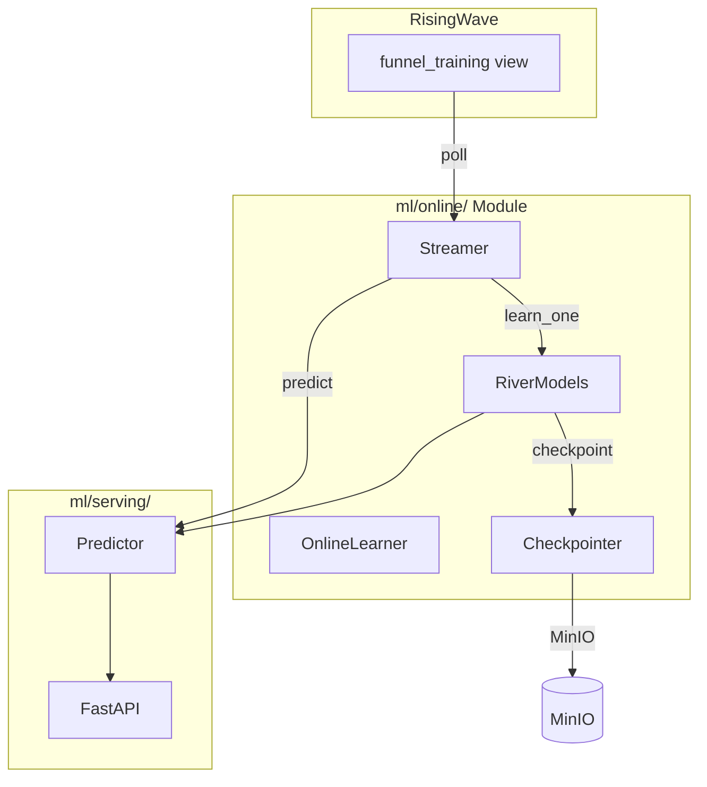

# River Online Learning Implementation Plan

## Overview
Replace batch ML training with River's incremental learning for real-time model updates.

## Architecture



## Files to Create

### 1. ml/online/__init__.py
Exports for online learning module.

### 2. ml/online/models.py
River model wrappers for each metric:
- LinearRegression for viewers, carters, purchasers
- HoeffdingTreeRegressor for rate predictions
- PARegressor as alternative

### 3. ml/online/streamer.py
Polls RisingWave funnel_training view every N seconds and yields records.

### 4. ml/online/learner.py
Continuous learning service that:
- Initializes models
- Calls streamer for new data
- Updates models with learn_one()
- Triggers periodic checkpoints

### 5. ml/online/checkpoints.py
MinIO-based checkpointing for River models (using pickle).

### 6. ml/serving/river_predictor.py
Prediction layer using River models instead of batch-trained models.

## Dependencies
Add to pyproject.toml:
```toml
"river>=0.22.0",
```

## Migration Strategy
1. Keep existing training/ module for fallback
2. Add online/ module parallel to serving/
3. Update serving to prefer River models if available
4. Add feature flag: USE_ONLINE_LEARNING=true

## API Changes
- GET /predict - Uses River models (instant prediction)
- POST /learn - Manual trigger to learn from a record
- GET /models - Shows River model states + checkpoint info

## Configuration
Environment variables:
- `USE_ONLINE_LEARNING=true` - Enable River models
- `ONLINE_LEARNING_INTERVAL=5` - Poll interval in seconds
- `CHECKPOINT_INTERVAL=60` - Seconds between checkpoints
